+++
title = "Look back 2025 and Prepare for 2026"
date = 2026-02-17
description = "Nhìn lại năm 2025 và những dự định cho năm 2026"

[taxonomies]
tags = ["Life"]

[extra]
featured_image = "images/image-25.png"
authors = [{name = "lilthawg29", url = "#"}]
venue = {name = "Life", date = "2026-02-17"}
buttons = []
toc = true
+++

## 0. Lời nói đầu

Mình viết bài này vào 1h sáng ngày 17/02/2026 dương lịch, tức là ngay mùng 1 Tết Bính Ngọ, sau khi đón giao thừa,chúc tết và mừng tuổi cho gia đình xong, mọi người đi ngủ hết, bố thì đi chúc tết nhà hàng xóm. Mình thấy thời điểm, không gian yên tĩnh như này rất thích hợp để khai bút, viết vài dòng tâm sự, nhìn lại năm cũ và chuẩn bị cho năm mới.

## 1. Nhìn lại 2025

### 1.1. Công việc

Năm nay mình vẫn đi làm như trước, tính đến giờ mình đã đi làm ở 1 công ty được hơn 3 năm rồi (chính xác là 3 năm 6 tháng), 1 cột mốc đối với mình là khá dài. Review 1 chút cho bạn nào tò mò về công việc của mình, thì mình đang là Red Team, Việt hoá chức năng bộ phận ở công ty là "Chuyên viên mô phỏng tấn công mạng". Hiểu nôm na là mình sẽ đóng vai trò là 1 hacker, tấn công vào hệ thống của công ty để tìm ra các lỗ hổng bảo mật, sau đó báo cáo lại cho bộ phận Blue Team (bộ phận phòng thủ) để khắc phục. Một hình thức doanh nghiệp tự tiêm vaccine cho chính mình để nâng cao năng lực phòng thủ chủ động, phòng khi bị tấn công thật (trộm vía) còn biết xử lý thế nào cho đỡ lóng ngóng, nhanh chóng, đúng quy trình. Nghe ngầu chứ ? :))) 

Mình không định đi sâu vào mô tả chi tiết công việc hàng ngày của mình vì theo mình, nó khá là khô khan. Hãy đi đến những thứ mà mình cảm thấy tự hào trong năm nay nhé :D

Đầu năm, nhìn vào đội hình team mới, mình cảm thấy khá tự tin, tin tưởng rằng năm nay thành tích sẽ tốt hơn năm 2024, mình đặt action plan khá tham vọng (chắc là do sếp khích tướng xD). Vậy nên những buổi sharing, những buổi luyện tập, teamwork cuối tuần, thậm chí là trong tuần diễn ra khá đều đặn.

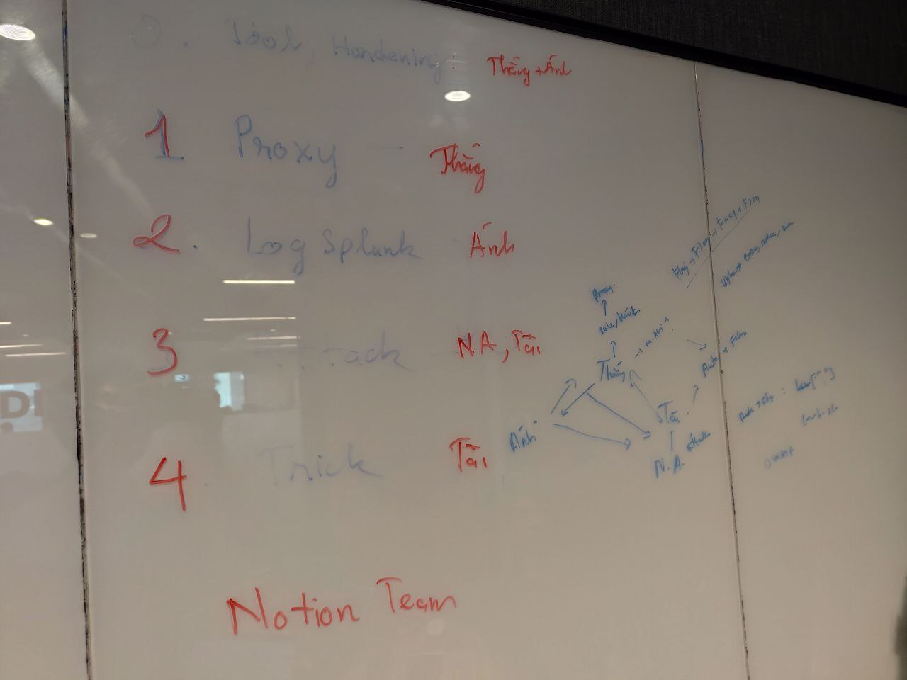

Vì vừa phải làm việc, vừa đặt mục tiêu cao, do thi cử này là optional nên không thể ép mọi người tập trung hết vào việc ôn thi được, nên đôi khi trong team sẽ có xích mích, mình và 1 teammate còn xích mích to nữa cơ :))) may là trước khi đi thi, anh em đã hoà giải để còn cùng nhau đi thi.

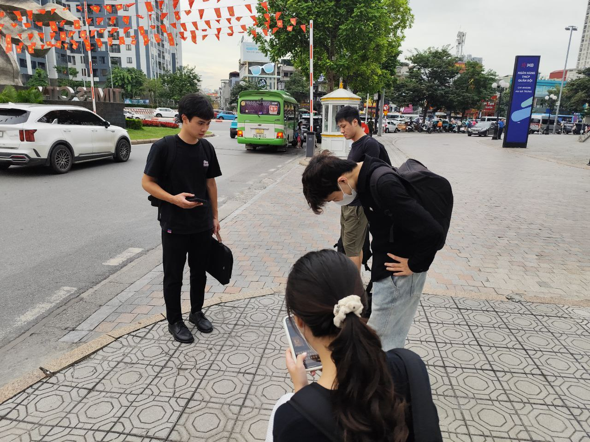

Mặc dù chuẩn bị khá là kỹ, nhưng mình vẫn không nghĩ được rằng BTC Security BootCamp 2025 có thể chuẩn bị đề thi thực tế như vậy, chuẩn bị cả hạ tầng, phần cứng cho cả hơn 20 đội thi cần nguồn nhân lực rất lớn, huy động được đội ngũ như vậy chứng tỏ ban tổ chức vô cùng tâm huyết với sự kiện lần này, nó không chỉ là CTF đơn thuần mà mình thường chơi nữa, vậy nên để bày tỏ sự ngưỡng mộ, mình đã ra cảm ơn riêng với anh trưởng BTC. Respect đội ngũ rất rất nhiều.

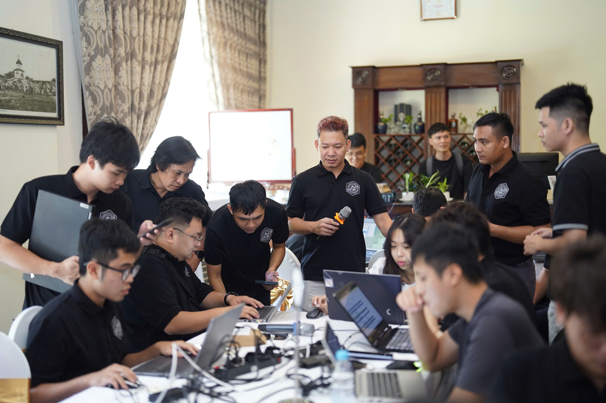

Về bản thân và đội nhóm, sau khi thấy kết quả không được như đề ra ban đầu, ai lấy cũng thất vọng, nhưng cuộc thi cũng đã phản ánh đúng năng lực của toàn đội, thua là thua, kém là kém, không có đổ thừa được. Khi về họp phòng, mình cũng đã tự nhận lỗi, tự nhận thấy những yếu kém của bản thân, khi chuẩn bị chưa đủ tốt và gặp tình huống bất ngờ, xử lý không được nhanh chóng, đưa ra các tactics không hợp lý, thấy cây mà không thấy rừng. Tất nhiên, sếp và mọi người ở phòng cũng thông cảm và động viên mình "chính ra đợt này thất bại lại thấy học được nhiều hơn đấy nhỉ :D".

Thế nhưng may mắn là ở cuộc thi Smart Banking 2025, chúng mình đã cụ thể hoá bằng kết quả, dành được giải nhì, mọi nỗ lực và cố gắng của mọi người cuối cùng cũng được ghi nhận. Điều này cũng giảm bớt áy náy trong mình khi trước đó mình vẫn tự trách bản thân là do mình mà đồng đội cố gắng, tham gia luyện tập đầy đủ, đóng góp cũng không được ghi nhận. (Shout out cho các đồng đội của tôi, cảm ơn vì đã đóng góp, cố gắng mặc dù tôi còn nhiều thiếu sót)

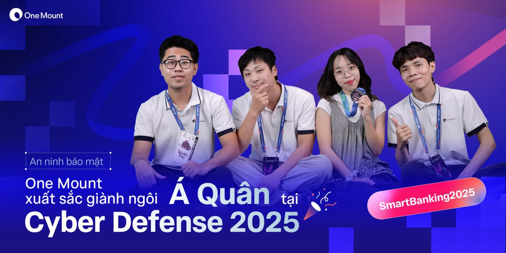

---

Về công việc cá nhân, có lẽ điều làm mình nhớ và excited nhất là khi mình leo thang được lên Project Owner trên GCP, mở ra 1 hướng đi mới Red Team trên Cloud, và mình đang tập trung vào nó đến giờ.

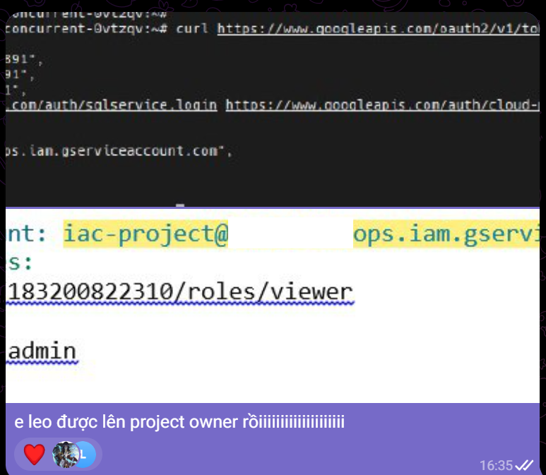

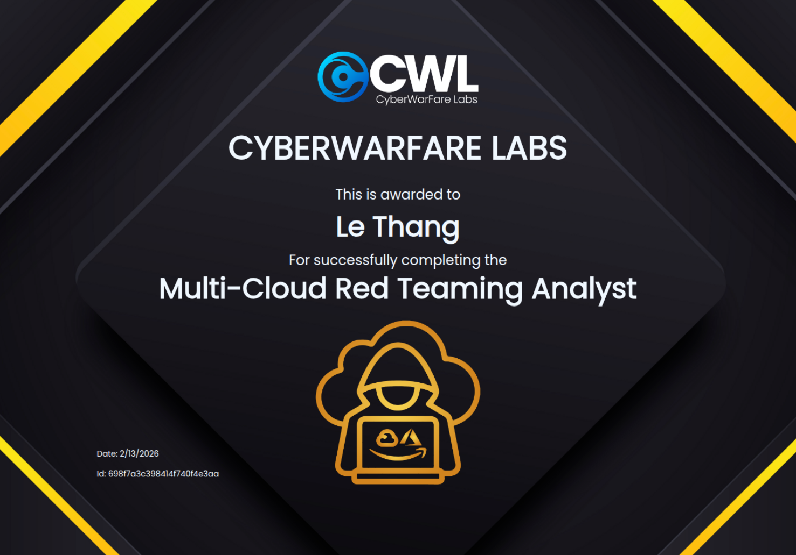

Các kỹ năng Red Team khác, mình vẫn luyện tập và cải thiện (trăm hay không bằng tay quen)

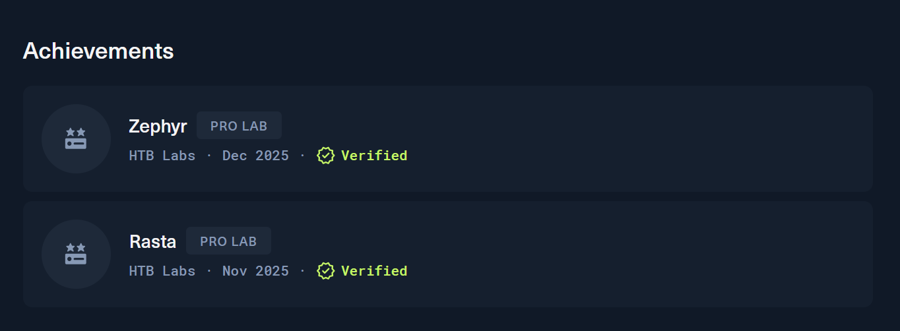

---

Về AI ? Tại sao lại có phần này ? 

Phần này mình mong muốn được trao đổi thêm với mọi người, mọi người nghĩ sao về AI, nó có ảnh hưởng đến công việc của mình không, nó có giúp ích, gây hại gì cho mình không, và mình nên làm gì để tận dụng nó, mọi người đang áp dụng nó vào công việc như thế nào ?

Bản thân mình tiếp xúc, vận dụng, cũng như dạy cho mấy đứa em ở CLB về AI, cách áp dụng nó trong công việc từ khá sớm. Mình hay dùng opencode + antigravity.

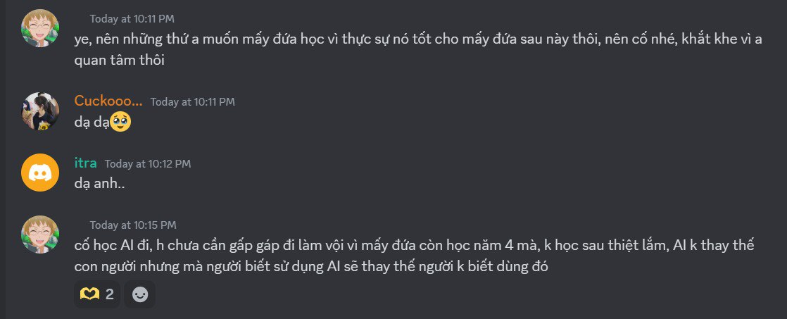

Trước đó, mình khá là fomo về AI, trend nào trên X cũng hóng, cũng thử, chi tiền cho các dịch vụ liên quan đến AI cũng khá nhiều. Nhưng gần đây, mình thấy mệt khi phải chạy theo nó, cố sử dụng thử các công cụ AI không giải quyết được bài toán của mình mà chỉ để nâng cao cái gọi là "hiểu biết về AI" trên mạng xã hội. 
Mình áp dụng AI trong công việc cũng khá nhiều, từ việc dev những công cụ đơn giản để hỗ trợ công việc, hay viết script exploit, hay là agent red team, tuy nhiên đặc điểm chung là shipcode, code dùng 1 lần, nên mình không thấy tự hào gì mà chia sẻ, public repo cả :)))

Những thứ mình tự gọi là "idea của mình" tự làm xong thì thấy có 1 opensource khác cũng làm tương tự mà hoàn chỉnh, ngon hơn nhiều rồi, chày cối tự vibecode lại, lúc fix bug còn trầm cảm hơn là tự code, chưa kể đến việc bị suy giảm tư duy, kém động não đi.

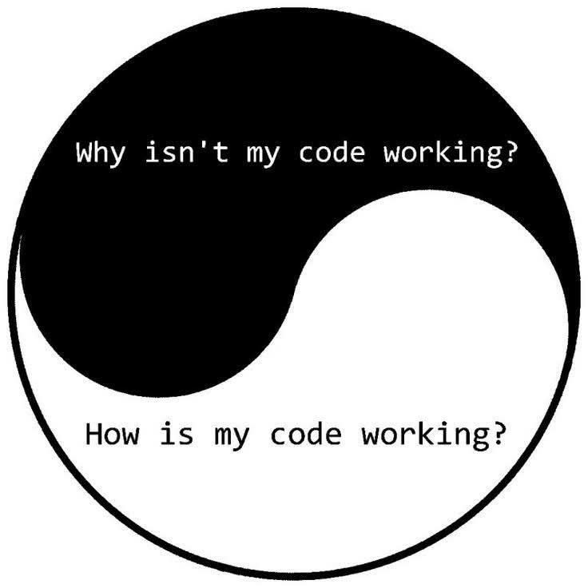

Mình có đem chuyện này trao đổi với a Vịnh trên bàn nhậu, thì ảnh chia sẻ rằng, chỉ những cái mà chưa ai dev, chưa ai nghĩ tới thì ảnh mới hỏi AI thôi, chứ không bao giờ cho AI làm hết mọi thứ. Mình thấy vậy cũng hợp lý, trước khi bắt đầu 1 idea, có lẽ nên tìm opensource nghiên cứu trước, thay vì vào vibecode luôn :(

Nhưng mình thấy với khả năng AI Agents hiện tại và trong tương lai, những tác vụ đơn giản, theo chiều rộng, AI Agents sẽ làm rất tốt, và con người sẽ không thể cạnh tranh được, ví dụ như việc scan, recon/enum bên ngoài. Vì vậy chúng ta cần sử dụng sao cho hợp lý, để AI làm những việc đơn giản, con người tập trung vào những việc phức tạp, đòi hỏi tư duy, sáng tạo.

Để nói về AI có lẽ cần 1 bài viết chi tiết hơn, nên mình xin phép không đề cập sâu ở đây. Mọi người có thể comment, trao đổi thêm với mình nhé. 

### 1.2. Cuộc sống

~~Viết đến đây thì mình thấy hơi mệt, nên đi ngủ phát~~

Ngoài cuộc sống công sở 9-to-6 (mình thường là 9-to-9 :v), mình vẫn cố gắng cân bằng với việc học, luyện tập, và dành thời gian cho gia đình, bạn bè.

Năm qua mình có 1 vài chuyến trip khá thú vị, nổi bật có lẽ là:
- Trip Sejong Hàn Quốc với ae KCSC

https://www.youtube.com/watch?v=9_BgcizU_c8

- Trip Nanjing Trung Quốc với ae KCSC
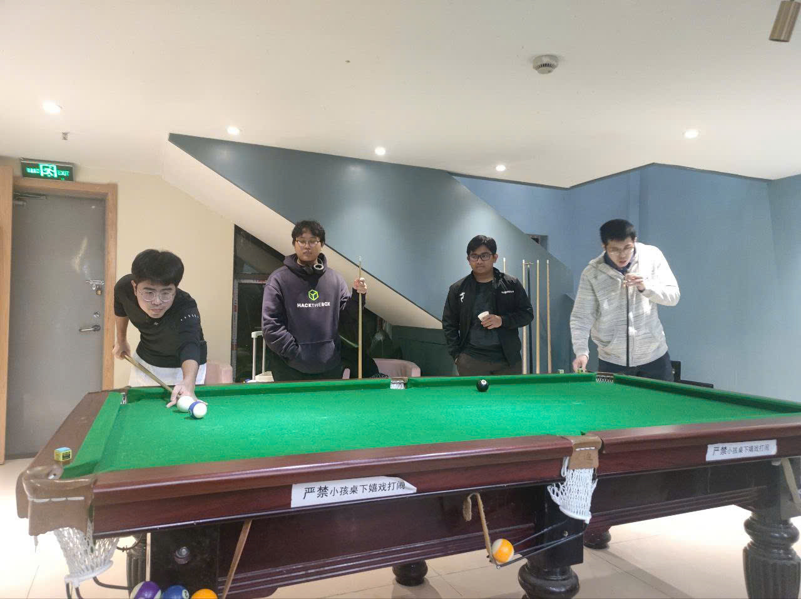
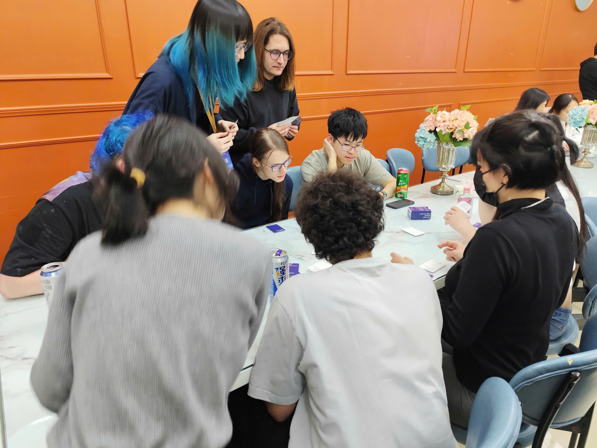
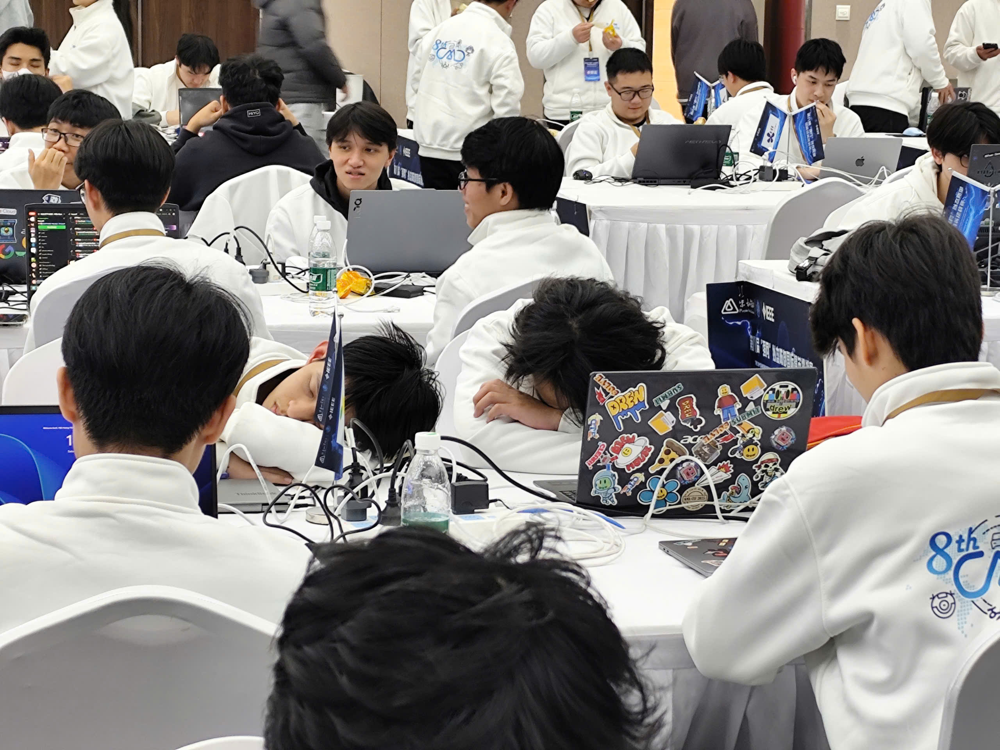
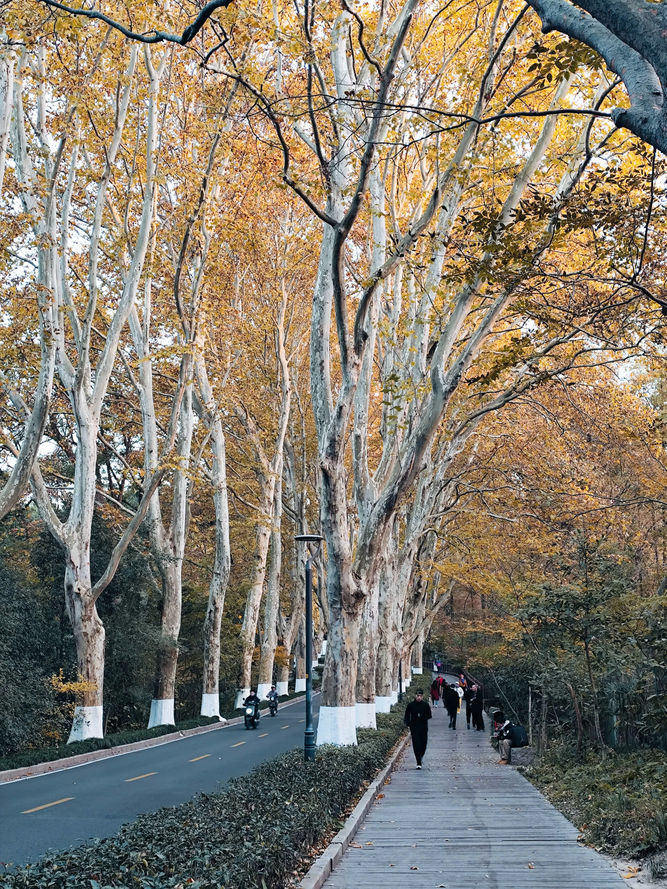

- Trip Cát Bà Hải Phòng với team bóng rổ
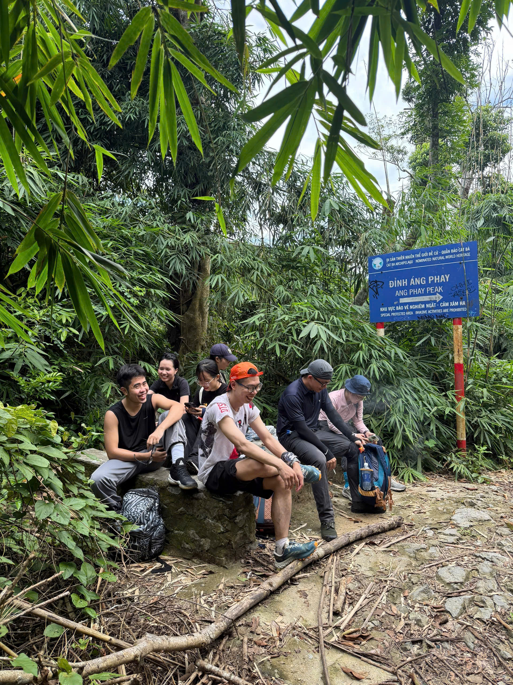
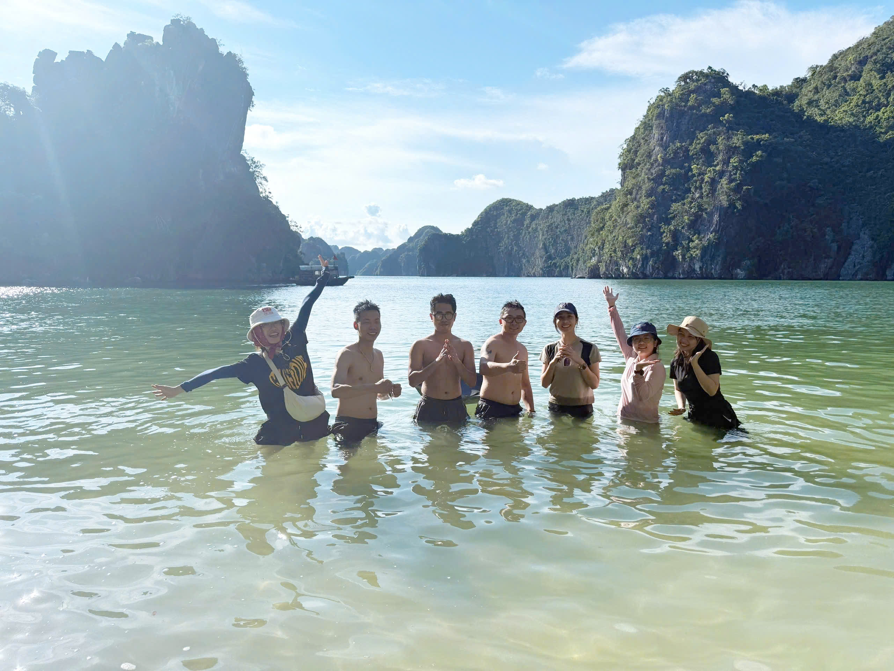
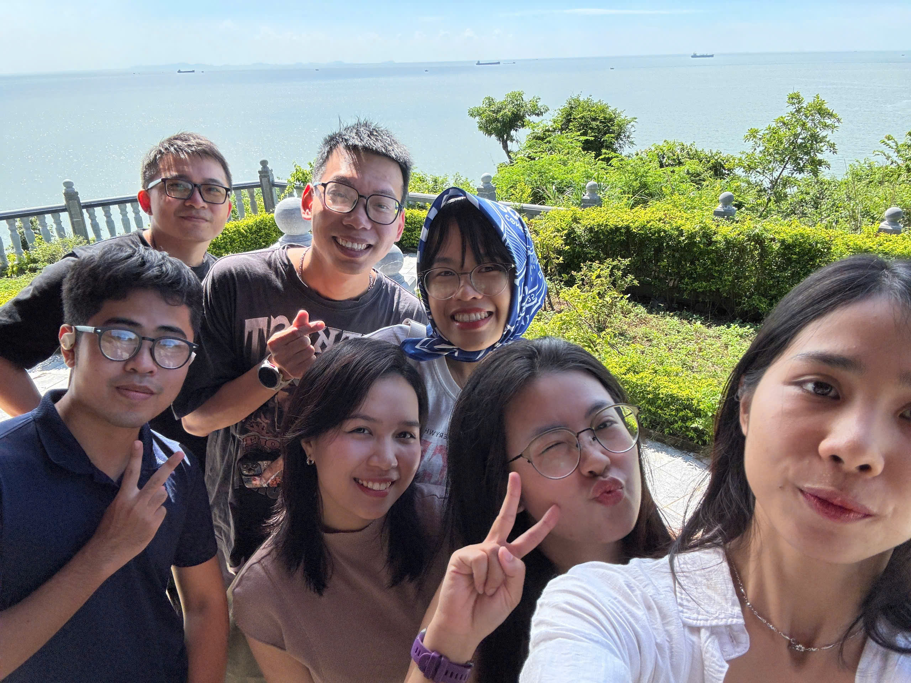

---

Về gia đình, năm qua may mắn thay bố mẹ mình vẫn khoẻ mạnh, không có chuyện gì quá nghiêm trọng xảy ra cả, vẫn là chỗ dựa tinh thần, nguồn động viên lớn cho mình. 

Mình ít về quê lắm, mình luôn nghĩ không có việc gì thì về làm gì, với công ty mình làm sáng T7 nên mình cũng nghĩ về chơi có 1 ngày thì không đáng. Làm việc 9-to-9, tối về còn phải tắm rửa, nghỉ ngơi, học hành thêm tý nào hay tý đó, nên mình cũng ít gọi điện thoại cho gia đình. Mình thường gọi điện cho mẹ vào mỗi T7 hoặc Chủ Nhật thôi, trong tuần hầu như không có gọi (nếu để nhìn nhận công tâm, thì mình thấy khá lạnh lùng và có phần vô tâm). 

Tuy nhiên, mẹ luôn là người chỉ bảo cho mình, dù mình đã lớn tới từng này, mẹ biết mình bận nên cũng ít khi gọi, mà toàn nhắn tin, cũng không đòi hỏi mình phải cho bố mẹ cái gì, mặc dù lần nào mình cũng bảo gửi tiền cho, nhưng mà mẹ vẫn khách sáo bảo vẫn đủ, bao giờ hết mẹ gọi, chứ để tiền nhiều trong tài khoản ngân hàng sợ ở quê bị lừa mất.

Những lần bố nằm viện, ông nằm viện, mẹ cũng thông báo cho mình, bảo dành ít thời gian quan tâm, gọi điện hỏi han ông và bố xem sao, chứ 1 thân 1 mình, tuổi già rồi, nằm ở viện đôi khi tủi thân. Mình vâng vâng, dạ dạ, rồi cũng gọi điện hỏi han, đôi khi chỉ là 1 hành động nhỏ thể hiện quan tâm cũng khiến cho người bệnh cảm thấy khá hơn rất nhiều. Đôi khi mình nghĩ vì mải mê vật lộn với cuộc sống cá nhân mà quên mất rằng, mình vẫn còn người thân bên cạnh, hãy san sẻ với họ cả về mặt tinh thần, chứ đừng là mỗi vật chất.

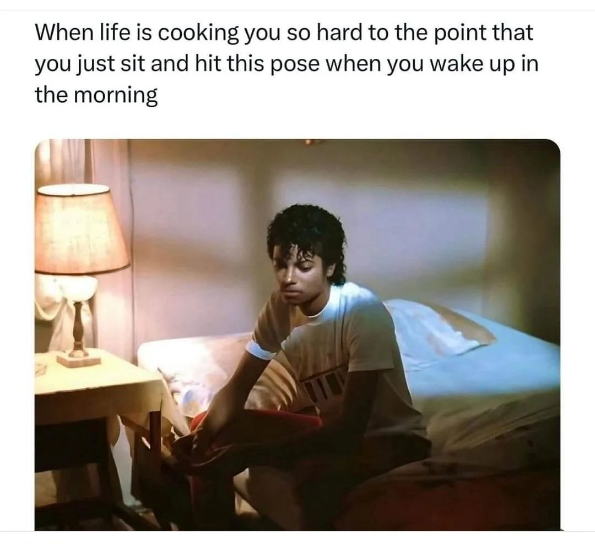

Tết này ở quê, mình bắt đầu để ý mọi thứ nhiều hơn, để ý tới những cảnh vật xung quanh, để ý tới những người xung quanh, để ý tới những điều nhỏ nhặt trong cuộc sống. 

Mình đạp xe mấy tiếng quanh khu mình sống, có cái thay đổi, có cái vẫn mang dấu ấn hoài niệm, cứ đạp, cứ đạp, mọi ký ức nó lại tràn về, đã có những nơi từ hồi cấp 1, cấp 2 mình không còn lui tới, nay nhìn lại tự mình có thể mỉm cười, mình yêu những ký ức, yêu nơi mình từng sống, đạp xe mà cảm giác hứng khởi, tươi mới.

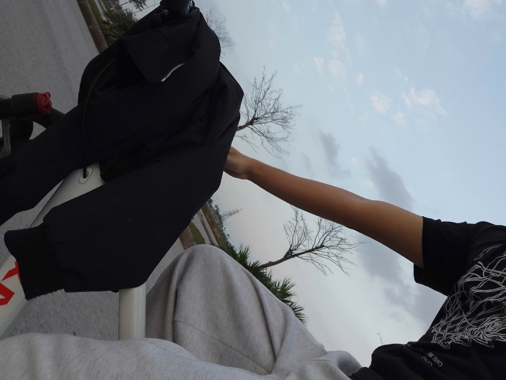
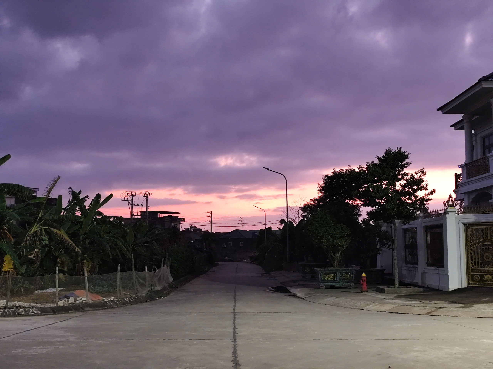

Mình thấy mình đã thay đổi rất nhiều so với trước đây. Mình thấy bố già hơn, trên ngón tay do phải đi làm đá xẻ, dưới áp lực nước lớn, ngón tay đã phải bong tróc da, nứt nẻ, nhìn mà đau thay. Những vật dụng trong nhà, có những thứ rất cũ rồi, mà bố mẹ cũng chỉ sửa lại để dùng chứ không dám mua mới. Mãi gần đây lúc đi sắm Tết, bố mới sắm được 1 cái mũ bảo hiểm rất ưng ý, mình xem lại cái mũ cũ - dạng mũ moto trùm đầu, thực sự là nó cũ lắm rồi, cái cai quài còn nát bươm, không cài được từ lâu, mình mới thấy là bấy lâu nay mình vẫn để bố mẹ sống như vậy mà không để ý gì sao ? vô tâm thật đấy. Nhìn bố mẹ vẫn đi làm, mình thấy thương vì bố nghỉ hưu rồi mà vẫn phải làm lụng thêm để nuôi gia đình. Nhưng nếu không đi làm, chỉ quanh quẩn ở nhà thôi thì buồn, tuổi tứ tuần mà, nên mình cũng chỉ bảo bố mẹ, giữ sức khoẻ, đừng làm việc quá sức.

https://www.youtube.com/watch?v=r8V93IONgN8

Mình có 1 cu em zai, năm nay cũng đầu tư tiền cho nó học IELTS để không phải chịu khổ như anh nó, nó học hành cũng được, cũng được đi thi tỉnh là oke rồi, ít ra là chăm học hơn thằng anh hồi trước (chứ không học giỏi hơn thằng anh được) :v 

---

Về chuyện tình cảm, năm qua là 1 năm "nhộn nhịp", có những mối tình mà còn chẳng kịp đặt tên, mình nghĩ là kết thúc rồi nên clear everything, mình lao đầu vào làm việc, không cho mình thời gian nghĩ ngợi linh tinh về nó, thế nhưng bằng cách này hay cách khác, trong 1 số khung thời gian chết, nó vẫn hiện hữu dù mình cố gắng đừng nghĩ đến rồi, chủ yếu trong đầu mình là 1 câu hỏi lặp lại: "Why?". Mình nghĩ mình là người rạch ròi, chuyện tình cảm và công việc, cuộc sống nên tách bạch với nhau. Thế nhưng bảo nó không ảnh hưởng đến mọi thứ, góc nhìn của mình sau sự kiện đó thì là nói dối.

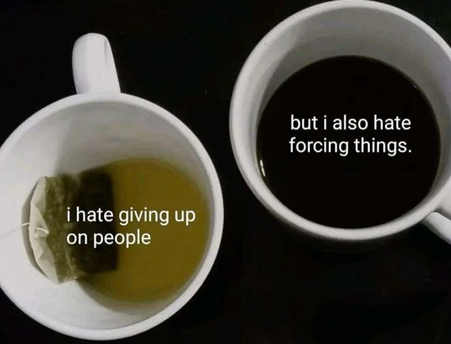

Mình không còn thấy hứng thú với bất kỳ thứ gì sau sự kiện đó, không còn tươi cười nhiều như trước, không còn giữ thói quen thích chụp ảnh, nhìn đâu cũng thấy cảnh vật mang 1 ý nghĩa nhất định. Trước đó, mình có thói quen dành rất nhiều thời gian để deep talk, nói chuyện sâu với ai đó để mong muốn tìm hiểu về người đó, muốn hiểu rõ hơn 1 tại sao 1 con người trải qua những biến cố, những sự kiện gì, tâm sinh lý phát triển ra sao để hình thành nên 1 con người hiện tại, chia sẻ góc nhìn, mindset, nhân sinh quan với mọi người, thế nhưng bây giờ mình hoàn toàn không muốn làm điều đó nữa, mình chỉ muốn yên lặng, mọi người xung quanh cũng tự nhận thẩy rằng phần nào đó trong mình đã thay đổi, chí ít là cái lửa, sự nhiệt tình bên trong giờ đã trở nên lạnh lẽo, mình không còn hứng thú update, chia sẻ cuộc sống trên MXH, mình không còn hứng thú để đi tìm hiểu con người nữa... (đến hiện tại thì có lẽ vậy ?)

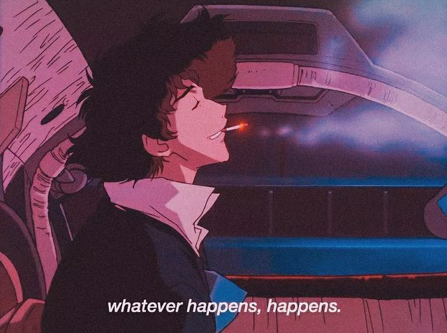

Nhưng chuyện gì đến thì phải đến, mọi sự việc xảy ra trên đời đều có lý do và ý nghĩa riêng của nó. Theo chủ nghĩa khắc kỷ, mình chỉ tập trung vào những gì bản thân có thể kiểm soát được còn những gì không thể, như việc "cảm thấy an toàn", tình cảm, suy nghĩ của người khác, thì đừng nên đặt nặng lòng, hay cố gắng cắt nghĩa, đi tìm hiểu tại sao họ lại có những suy nghĩ như vậy. 

---

Cuối năm 2025, mình quyết định đi học tiếp thạc sĩ ở trường cũ (KMA), cũng đắn đo, xem xét khá lâu rồi mới đưa ra quyết định. Mình muốn có tấm bằng thạc sĩ để có thể đi dạy, để đi chia sẻ những kiến thức, kinh nghiệm của mình cho các bạn sinh viên, định hướng, chia sẻ tốt hơn cho các em, các em có thể không cần phải đi theo con đường của mình, nhưng ít ra là có thêm 1 góc nhìn, 1 sự tham khảo để có thể đưa ra những quyết định phù hợp với bản thân.

Mình cũng đang thử nghiệm 1 số cái mới, mở rộng network, chưa thực sự nhìn thấy luôn kết quả, nhưng mình tin là nó sẽ tốt cho mình trong tương lai, cứ hành động đã, thay vì ngồi nghĩ rằng làm như vậy nhìn cringe, không phù hợp với bản thân. 

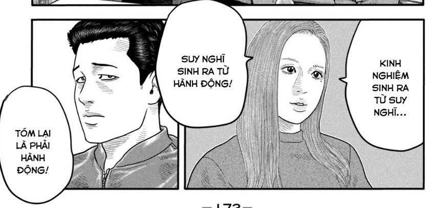

Vòng tròn bạn bè của mình năm nay cũng tăng không nhiều (còn chưa có thời gian xem có ai lọc bớt mình không nữa :v) đi làm thì vẫn vậy, đi học, đi tham gia mấy sự kiện bên ngoài thì có kết bạn được, nhưng đúng là ở cái độ tuổi 25, làm quen, kết thân, tâm sự được với một ai đó thực sự là 1 chuyện khá dài và gian nan, mọi người sau khi đi làm rồi khó mở lòng, không có thời gian mà tâm sự, chia sẻ với nhau như thời sinh viên nữa, các mối quan hệ có tăng lên nhưng dừng ở mức xã giao thôi, mình cũng cố gắng kết thân, làm quen nhưng thấy khó quá à. Vậy nên những bạn đang còn là học sinh, sinh viên, cố gắng xây dựng, gìn giữ những mối quan hệ tốt đẹp, bền chặt nhé :)

## 2. Chuẩn bị cho 2026

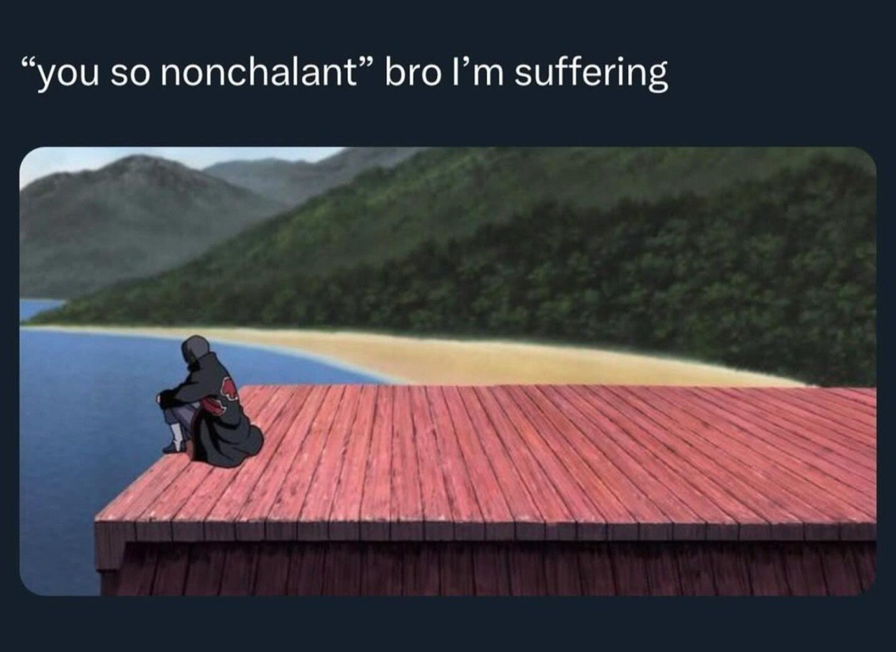

Năm 2026 này, mình quyết định sẽ có một vài chuyển biến mới, thử nghiệm, thử và sai, mình nghĩ là đặc quyền xa xỉ nhất của người trẻ là được phép phạm sai lầm, nên là hãy thử thôi ?

Mình khá nghiêm túc với việc dạy học, mình không muốn kiến thức học được, những kinh nghiệm tích luỹ được lại chỉ để ghi vào CV mới ? Vậy nên thời gian vài tháng thử nghiệm sẽ là đủ để mình rút ra được gì đó.
Hơn nữa, mình cũng cần có 1 khoảng thời gian nhìn nhận lại bản thân và deep work, research, học tập các kỹ năng nhất định mà khung thời gian 9-to-5 không cho phép mình làm được.

Xin cảm ơn những ai đọc đến đây, nếu là mấy đứa em thì anh Thắng xin lỗi vì đã không sát sao, hỏi thăm, hoặc lạnh nhạt trong thời gian qua hoặc sắp tới, chỉ là tâm trí anh đang tập trung hoàn toàn vào những dự định cá nhân, gia đình và công việc, thông cảm nhé, nếu có thể, anh thực sự muốn bao bọc, chỉ bảo nhiều hơn, nhưng "Life is cooked, I'm trying my best. I'll be back" :)) thời điểm này suffer 1 mình là tốt nhất.

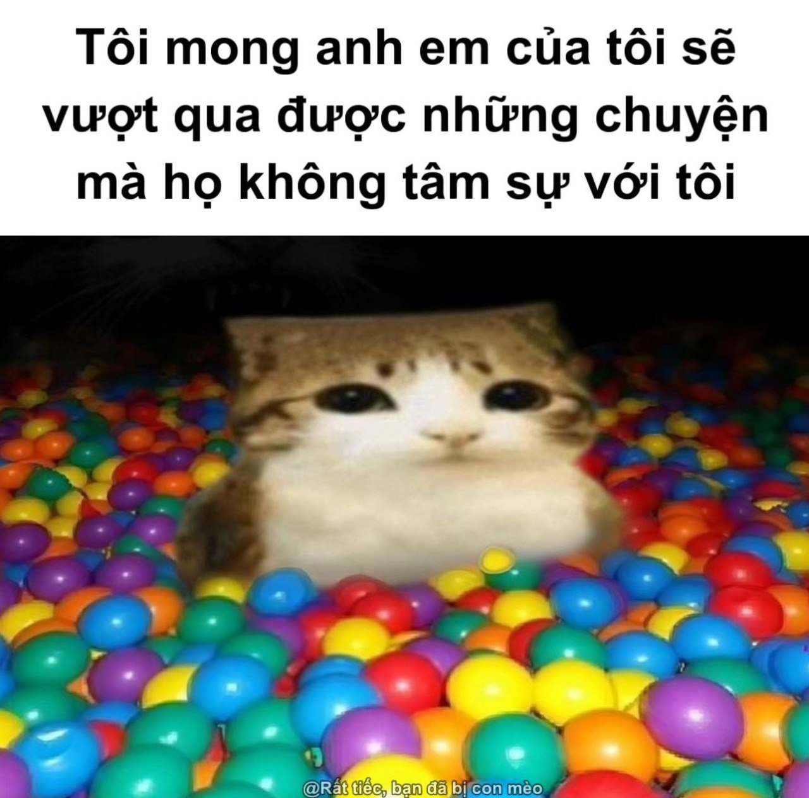

Chúc mừng năm mới toàn thể mọi người, hy vọng những dự định trong năm mới của mọi người đều thành công, giữ sức khoẻ nhé.